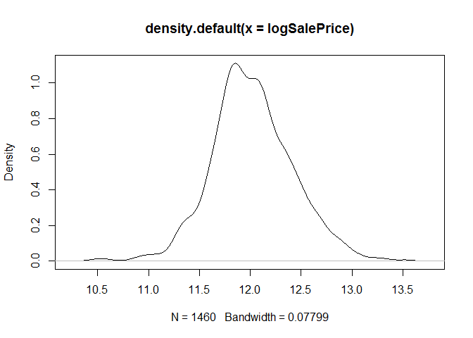
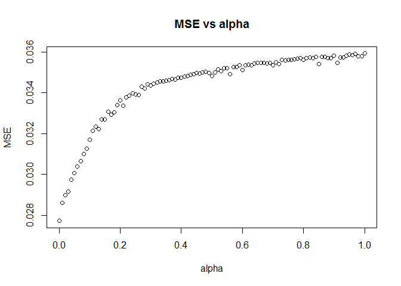
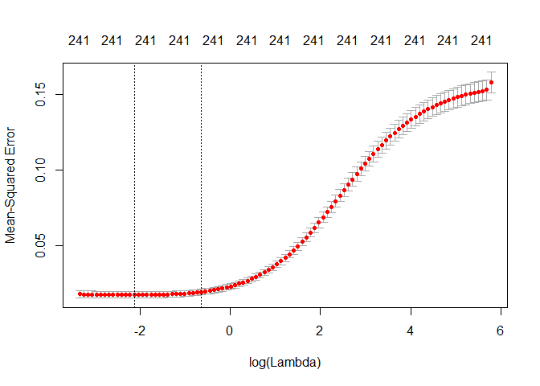

### Goal: Analyze the house price dataset from Kaggle and build linear regression models

### 1. Read in data and take a look

    train <- read.csv("train.csv", stringsAsFactors = FALSE)
    summary(train)

    ##        Id           MSSubClass      MSZoning          LotFrontage    
    ##  Min.   :   1.0   Min.   : 20.0   Length:1460        Min.   : 21.00  
    ##  1st Qu.: 365.8   1st Qu.: 20.0   Class :character   1st Qu.: 59.00  
    ##  Median : 730.5   Median : 50.0   Mode  :character   Median : 69.00  
    ##  Mean   : 730.5   Mean   : 56.9                      Mean   : 70.05  
    ##  3rd Qu.:1095.2   3rd Qu.: 70.0                      3rd Qu.: 80.00  
    ##  Max.   :1460.0   Max.   :190.0                      Max.   :313.00  
    ##                                                      NA's   :259     
    ##     LotArea          Street             Alley             LotShape        
    ##  Min.   :  1300   Length:1460        Length:1460        Length:1460       
    ##  1st Qu.:  7554   Class :character   Class :character   Class :character  
    ##  Median :  9478   Mode  :character   Mode  :character   Mode  :character  
    ##  Mean   : 10517                                                           
    ##  3rd Qu.: 11602                                                           
    ##  Max.   :215245                                                           
    ##                                                                           
    ##  LandContour         Utilities          LotConfig        
    ##  Length:1460        Length:1460        Length:1460       
    ##  Class :character   Class :character   Class :character  
    ##  Mode  :character   Mode  :character   Mode  :character  
    ##                                                          
    ##                                                          
    ##                                                          
    ##                                                          
    ##   LandSlope         Neighborhood        Condition1       
    ##  Length:1460        Length:1460        Length:1460       
    ##  Class :character   Class :character   Class :character  
    ##  Mode  :character   Mode  :character   Mode  :character  
    ##                                                          
    ##                                                          
    ##                                                          
    ##                                                          
    ##   Condition2          BldgType          HouseStyle         OverallQual    
    ##  Length:1460        Length:1460        Length:1460        Min.   : 1.000  
    ##  Class :character   Class :character   Class :character   1st Qu.: 5.000  
    ##  Mode  :character   Mode  :character   Mode  :character   Median : 6.000  
    ##                                                           Mean   : 6.099  
    ##                                                           3rd Qu.: 7.000  
    ##                                                           Max.   :10.000  
    ##                                                                           
    ##   OverallCond      YearBuilt     YearRemodAdd   RoofStyle        
    ##  Min.   :1.000   Min.   :1872   Min.   :1950   Length:1460       
    ##  1st Qu.:5.000   1st Qu.:1954   1st Qu.:1967   Class :character  
    ##  Median :5.000   Median :1973   Median :1994   Mode  :character  
    ##  Mean   :5.575   Mean   :1971   Mean   :1985                     
    ##  3rd Qu.:6.000   3rd Qu.:2000   3rd Qu.:2004                     
    ##  Max.   :9.000   Max.   :2010   Max.   :2010                     
    ##                                                                  
    ##    RoofMatl         Exterior1st        Exterior2nd       
    ##  Length:1460        Length:1460        Length:1460       
    ##  Class :character   Class :character   Class :character  
    ##  Mode  :character   Mode  :character   Mode  :character  
    ##                                                          
    ##                                                          
    ##                                                          
    ##                                                          
    ##   MasVnrType          MasVnrArea      ExterQual          ExterCond        
    ##  Length:1460        Min.   :   0.0   Length:1460        Length:1460       
    ##  Class :character   1st Qu.:   0.0   Class :character   Class :character  
    ##  Mode  :character   Median :   0.0   Mode  :character   Mode  :character  
    ##                     Mean   : 103.7                                        
    ##                     3rd Qu.: 166.0                                        
    ##                     Max.   :1600.0                                        
    ##                     NA's   :8                                             
    ##   Foundation          BsmtQual           BsmtCond        
    ##  Length:1460        Length:1460        Length:1460       
    ##  Class :character   Class :character   Class :character  
    ##  Mode  :character   Mode  :character   Mode  :character  
    ##                                                          
    ##                                                          
    ##                                                          
    ##                                                          
    ##  BsmtExposure       BsmtFinType1         BsmtFinSF1     BsmtFinType2      
    ##  Length:1460        Length:1460        Min.   :   0.0   Length:1460       
    ##  Class :character   Class :character   1st Qu.:   0.0   Class :character  
    ##  Mode  :character   Mode  :character   Median : 383.5   Mode  :character  
    ##                                        Mean   : 443.6                     
    ##                                        3rd Qu.: 712.2                     
    ##                                        Max.   :5644.0                     
    ##                                                                           
    ##    BsmtFinSF2        BsmtUnfSF       TotalBsmtSF       Heating         
    ##  Min.   :   0.00   Min.   :   0.0   Min.   :   0.0   Length:1460       
    ##  1st Qu.:   0.00   1st Qu.: 223.0   1st Qu.: 795.8   Class :character  
    ##  Median :   0.00   Median : 477.5   Median : 991.5   Mode  :character  
    ##  Mean   :  46.55   Mean   : 567.2   Mean   :1057.4                     
    ##  3rd Qu.:   0.00   3rd Qu.: 808.0   3rd Qu.:1298.2                     
    ##  Max.   :1474.00   Max.   :2336.0   Max.   :6110.0                     
    ##                                                                        
    ##   HeatingQC          CentralAir         Electrical          X1stFlrSF   
    ##  Length:1460        Length:1460        Length:1460        Min.   : 334  
    ##  Class :character   Class :character   Class :character   1st Qu.: 882  
    ##  Mode  :character   Mode  :character   Mode  :character   Median :1087  
    ##                                                           Mean   :1163  
    ##                                                           3rd Qu.:1391  
    ##                                                           Max.   :4692  
    ##                                                                         
    ##    X2ndFlrSF     LowQualFinSF       GrLivArea     BsmtFullBath   
    ##  Min.   :   0   Min.   :  0.000   Min.   : 334   Min.   :0.0000  
    ##  1st Qu.:   0   1st Qu.:  0.000   1st Qu.:1130   1st Qu.:0.0000  
    ##  Median :   0   Median :  0.000   Median :1464   Median :0.0000  
    ##  Mean   : 347   Mean   :  5.845   Mean   :1515   Mean   :0.4253  
    ##  3rd Qu.: 728   3rd Qu.:  0.000   3rd Qu.:1777   3rd Qu.:1.0000  
    ##  Max.   :2065   Max.   :572.000   Max.   :5642   Max.   :3.0000  
    ##                                                                  
    ##   BsmtHalfBath        FullBath        HalfBath       BedroomAbvGr  
    ##  Min.   :0.00000   Min.   :0.000   Min.   :0.0000   Min.   :0.000  
    ##  1st Qu.:0.00000   1st Qu.:1.000   1st Qu.:0.0000   1st Qu.:2.000  
    ##  Median :0.00000   Median :2.000   Median :0.0000   Median :3.000  
    ##  Mean   :0.05753   Mean   :1.565   Mean   :0.3829   Mean   :2.866  
    ##  3rd Qu.:0.00000   3rd Qu.:2.000   3rd Qu.:1.0000   3rd Qu.:3.000  
    ##  Max.   :2.00000   Max.   :3.000   Max.   :2.0000   Max.   :8.000  
    ##                                                                    
    ##   KitchenAbvGr   KitchenQual         TotRmsAbvGrd     Functional       
    ##  Min.   :0.000   Length:1460        Min.   : 2.000   Length:1460       
    ##  1st Qu.:1.000   Class :character   1st Qu.: 5.000   Class :character  
    ##  Median :1.000   Mode  :character   Median : 6.000   Mode  :character  
    ##  Mean   :1.047                      Mean   : 6.518                     
    ##  3rd Qu.:1.000                      3rd Qu.: 7.000                     
    ##  Max.   :3.000                      Max.   :14.000                     
    ##                                                                        
    ##    Fireplaces    FireplaceQu         GarageType         GarageYrBlt  
    ##  Min.   :0.000   Length:1460        Length:1460        Min.   :1900  
    ##  1st Qu.:0.000   Class :character   Class :character   1st Qu.:1961  
    ##  Median :1.000   Mode  :character   Mode  :character   Median :1980  
    ##  Mean   :0.613                                         Mean   :1979  
    ##  3rd Qu.:1.000                                         3rd Qu.:2002  
    ##  Max.   :3.000                                         Max.   :2010  
    ##                                                        NA's   :81    
    ##  GarageFinish         GarageCars      GarageArea      GarageQual       
    ##  Length:1460        Min.   :0.000   Min.   :   0.0   Length:1460       
    ##  Class :character   1st Qu.:1.000   1st Qu.: 334.5   Class :character  
    ##  Mode  :character   Median :2.000   Median : 480.0   Mode  :character  
    ##                     Mean   :1.767   Mean   : 473.0                     
    ##                     3rd Qu.:2.000   3rd Qu.: 576.0                     
    ##                     Max.   :4.000   Max.   :1418.0                     
    ##                                                                        
    ##   GarageCond         PavedDrive          WoodDeckSF      OpenPorchSF    
    ##  Length:1460        Length:1460        Min.   :  0.00   Min.   :  0.00  
    ##  Class :character   Class :character   1st Qu.:  0.00   1st Qu.:  0.00  
    ##  Mode  :character   Mode  :character   Median :  0.00   Median : 25.00  
    ##                                        Mean   : 94.24   Mean   : 46.66  
    ##                                        3rd Qu.:168.00   3rd Qu.: 68.00  
    ##                                        Max.   :857.00   Max.   :547.00  
    ##                                                                         
    ##  EnclosedPorch      X3SsnPorch      ScreenPorch        PoolArea      
    ##  Min.   :  0.00   Min.   :  0.00   Min.   :  0.00   Min.   :  0.000  
    ##  1st Qu.:  0.00   1st Qu.:  0.00   1st Qu.:  0.00   1st Qu.:  0.000  
    ##  Median :  0.00   Median :  0.00   Median :  0.00   Median :  0.000  
    ##  Mean   : 21.95   Mean   :  3.41   Mean   : 15.06   Mean   :  2.759  
    ##  3rd Qu.:  0.00   3rd Qu.:  0.00   3rd Qu.:  0.00   3rd Qu.:  0.000  
    ##  Max.   :552.00   Max.   :508.00   Max.   :480.00   Max.   :738.000  
    ##                                                                      
    ##     PoolQC             Fence           MiscFeature       
    ##  Length:1460        Length:1460        Length:1460       
    ##  Class :character   Class :character   Class :character  
    ##  Mode  :character   Mode  :character   Mode  :character  
    ##                                                          
    ##                                                          
    ##                                                          
    ##                                                          
    ##     MiscVal             MoSold           YrSold       SaleType        
    ##  Min.   :    0.00   Min.   : 1.000   Min.   :2006   Length:1460       
    ##  1st Qu.:    0.00   1st Qu.: 5.000   1st Qu.:2007   Class :character  
    ##  Median :    0.00   Median : 6.000   Median :2008   Mode  :character  
    ##  Mean   :   43.49   Mean   : 6.322   Mean   :2008                     
    ##  3rd Qu.:    0.00   3rd Qu.: 8.000   3rd Qu.:2009                     
    ##  Max.   :15500.00   Max.   :12.000   Max.   :2010                     
    ##                                                                       
    ##  SaleCondition        SalePrice     
    ##  Length:1460        Min.   : 34900  
    ##  Class :character   1st Qu.:129975  
    ##  Mode  :character   Median :163000  
    ##                     Mean   :180921  
    ##                     3rd Qu.:214000  
    ##                     Max.   :755000  
    ## 

    str(train)

    ## 'data.frame':    1460 obs. of  81 variables:
    ##  $ Id           : int  1 2 3 4 5 6 7 8 9 10 ...
    ##  $ MSSubClass   : int  60 20 60 70 60 50 20 60 50 190 ...
    ##  $ MSZoning     : chr  "RL" "RL" "RL" "RL" ...
    ##  $ LotFrontage  : int  65 80 68 60 84 85 75 NA 51 50 ...
    ##  $ LotArea      : int  8450 9600 11250 9550 14260 14115 10084 10382 6120 7420 ...
    ##  $ Street       : chr  "Pave" "Pave" "Pave" "Pave" ...
    ##  $ Alley        : chr  NA NA NA NA ...
    ##  $ LotShape     : chr  "Reg" "Reg" "IR1" "IR1" ...
    ##  $ LandContour  : chr  "Lvl" "Lvl" "Lvl" "Lvl" ...
    ##  $ Utilities    : chr  "AllPub" "AllPub" "AllPub" "AllPub" ...
    ##  $ LotConfig    : chr  "Inside" "FR2" "Inside" "Corner" ...
    ##  $ LandSlope    : chr  "Gtl" "Gtl" "Gtl" "Gtl" ...
    ##  $ Neighborhood : chr  "CollgCr" "Veenker" "CollgCr" "Crawfor" ...
    ##  $ Condition1   : chr  "Norm" "Feedr" "Norm" "Norm" ...
    ##  $ Condition2   : chr  "Norm" "Norm" "Norm" "Norm" ...
    ##  $ BldgType     : chr  "1Fam" "1Fam" "1Fam" "1Fam" ...
    ##  $ HouseStyle   : chr  "2Story" "1Story" "2Story" "2Story" ...
    ##  $ OverallQual  : int  7 6 7 7 8 5 8 7 7 5 ...
    ##  $ OverallCond  : int  5 8 5 5 5 5 5 6 5 6 ...
    ##  $ YearBuilt    : int  2003 1976 2001 1915 2000 1993 2004 1973 1931 1939 ...
    ##  $ YearRemodAdd : int  2003 1976 2002 1970 2000 1995 2005 1973 1950 1950 ...
    ##  $ RoofStyle    : chr  "Gable" "Gable" "Gable" "Gable" ...
    ##  $ RoofMatl     : chr  "CompShg" "CompShg" "CompShg" "CompShg" ...
    ##  $ Exterior1st  : chr  "VinylSd" "MetalSd" "VinylSd" "Wd Sdng" ...
    ##  $ Exterior2nd  : chr  "VinylSd" "MetalSd" "VinylSd" "Wd Shng" ...
    ##  $ MasVnrType   : chr  "BrkFace" "None" "BrkFace" "None" ...
    ##  $ MasVnrArea   : int  196 0 162 0 350 0 186 240 0 0 ...
    ##  $ ExterQual    : chr  "Gd" "TA" "Gd" "TA" ...
    ##  $ ExterCond    : chr  "TA" "TA" "TA" "TA" ...
    ##  $ Foundation   : chr  "PConc" "CBlock" "PConc" "BrkTil" ...
    ##  $ BsmtQual     : chr  "Gd" "Gd" "Gd" "TA" ...
    ##  $ BsmtCond     : chr  "TA" "TA" "TA" "Gd" ...
    ##  $ BsmtExposure : chr  "No" "Gd" "Mn" "No" ...
    ##  $ BsmtFinType1 : chr  "GLQ" "ALQ" "GLQ" "ALQ" ...
    ##  $ BsmtFinSF1   : int  706 978 486 216 655 732 1369 859 0 851 ...
    ##  $ BsmtFinType2 : chr  "Unf" "Unf" "Unf" "Unf" ...
    ##  $ BsmtFinSF2   : int  0 0 0 0 0 0 0 32 0 0 ...
    ##  $ BsmtUnfSF    : int  150 284 434 540 490 64 317 216 952 140 ...
    ##  $ TotalBsmtSF  : int  856 1262 920 756 1145 796 1686 1107 952 991 ...
    ##  $ Heating      : chr  "GasA" "GasA" "GasA" "GasA" ...
    ##  $ HeatingQC    : chr  "Ex" "Ex" "Ex" "Gd" ...
    ##  $ CentralAir   : chr  "Y" "Y" "Y" "Y" ...
    ##  $ Electrical   : chr  "SBrkr" "SBrkr" "SBrkr" "SBrkr" ...
    ##  $ X1stFlrSF    : int  856 1262 920 961 1145 796 1694 1107 1022 1077 ...
    ##  $ X2ndFlrSF    : int  854 0 866 756 1053 566 0 983 752 0 ...
    ##  $ LowQualFinSF : int  0 0 0 0 0 0 0 0 0 0 ...
    ##  $ GrLivArea    : int  1710 1262 1786 1717 2198 1362 1694 2090 1774 1077 ...
    ##  $ BsmtFullBath : int  1 0 1 1 1 1 1 1 0 1 ...
    ##  $ BsmtHalfBath : int  0 1 0 0 0 0 0 0 0 0 ...
    ##  $ FullBath     : int  2 2 2 1 2 1 2 2 2 1 ...
    ##  $ HalfBath     : int  1 0 1 0 1 1 0 1 0 0 ...
    ##  $ BedroomAbvGr : int  3 3 3 3 4 1 3 3 2 2 ...
    ##  $ KitchenAbvGr : int  1 1 1 1 1 1 1 1 2 2 ...
    ##  $ KitchenQual  : chr  "Gd" "TA" "Gd" "Gd" ...
    ##  $ TotRmsAbvGrd : int  8 6 6 7 9 5 7 7 8 5 ...
    ##  $ Functional   : chr  "Typ" "Typ" "Typ" "Typ" ...
    ##  $ Fireplaces   : int  0 1 1 1 1 0 1 2 2 2 ...
    ##  $ FireplaceQu  : chr  NA "TA" "TA" "Gd" ...
    ##  $ GarageType   : chr  "Attchd" "Attchd" "Attchd" "Detchd" ...
    ##  $ GarageYrBlt  : int  2003 1976 2001 1998 2000 1993 2004 1973 1931 1939 ...
    ##  $ GarageFinish : chr  "RFn" "RFn" "RFn" "Unf" ...
    ##  $ GarageCars   : int  2 2 2 3 3 2 2 2 2 1 ...
    ##  $ GarageArea   : int  548 460 608 642 836 480 636 484 468 205 ...
    ##  $ GarageQual   : chr  "TA" "TA" "TA" "TA" ...
    ##  $ GarageCond   : chr  "TA" "TA" "TA" "TA" ...
    ##  $ PavedDrive   : chr  "Y" "Y" "Y" "Y" ...
    ##  $ WoodDeckSF   : int  0 298 0 0 192 40 255 235 90 0 ...
    ##  $ OpenPorchSF  : int  61 0 42 35 84 30 57 204 0 4 ...
    ##  $ EnclosedPorch: int  0 0 0 272 0 0 0 228 205 0 ...
    ##  $ X3SsnPorch   : int  0 0 0 0 0 320 0 0 0 0 ...
    ##  $ ScreenPorch  : int  0 0 0 0 0 0 0 0 0 0 ...
    ##  $ PoolArea     : int  0 0 0 0 0 0 0 0 0 0 ...
    ##  $ PoolQC       : chr  NA NA NA NA ...
    ##  $ Fence        : chr  NA NA NA NA ...
    ##  $ MiscFeature  : chr  NA NA NA NA ...
    ##  $ MiscVal      : int  0 0 0 0 0 700 0 350 0 0 ...
    ##  $ MoSold       : int  2 5 9 2 12 10 8 11 4 1 ...
    ##  $ YrSold       : int  2008 2007 2008 2006 2008 2009 2007 2009 2008 2008 ...
    ##  $ SaleType     : chr  "WD" "WD" "WD" "WD" ...
    ##  $ SaleCondition: chr  "Normal" "Normal" "Normal" "Abnorml" ...
    ##  $ SalePrice    : int  208500 181500 223500 140000 250000 143000 307000 200000 129900 118000 ...

    dim(train)

    ## [1] 1460   81

#### There are both categorical and continuous variables. Some variables contain NA values.

### 1. Variables with too many missing values are not helpful in making a prediction model. Remove variables with more than 5% missing value.

    keep.col <- colnames(train)[which(sapply(train, function(x) sum(is.na(x))/length(x) < 0.05))]

    train <- train[,keep.col]
    dim(train)

    ## [1] 1460   70

    # Check left features with missing values 
    sort(sapply(train, function(x) sum(is.na(x))), decreasing = TRUE)

    ##  BsmtExposure  BsmtFinType2      BsmtQual      BsmtCond  BsmtFinType1 
    ##            38            38            37            37            37 
    ##    MasVnrType    MasVnrArea    Electrical            Id    MSSubClass 
    ##             8             8             1             0             0 
    ##      MSZoning       LotArea        Street      LotShape   LandContour 
    ##             0             0             0             0             0 
    ##     Utilities     LotConfig     LandSlope  Neighborhood    Condition1 
    ##             0             0             0             0             0 
    ##    Condition2      BldgType    HouseStyle   OverallQual   OverallCond 
    ##             0             0             0             0             0 
    ##     YearBuilt  YearRemodAdd     RoofStyle      RoofMatl   Exterior1st 
    ##             0             0             0             0             0 
    ##   Exterior2nd     ExterQual     ExterCond    Foundation    BsmtFinSF1 
    ##             0             0             0             0             0 
    ##    BsmtFinSF2     BsmtUnfSF   TotalBsmtSF       Heating     HeatingQC 
    ##             0             0             0             0             0 
    ##    CentralAir     X1stFlrSF     X2ndFlrSF  LowQualFinSF     GrLivArea 
    ##             0             0             0             0             0 
    ##  BsmtFullBath  BsmtHalfBath      FullBath      HalfBath  BedroomAbvGr 
    ##             0             0             0             0             0 
    ##  KitchenAbvGr   KitchenQual  TotRmsAbvGrd    Functional    Fireplaces 
    ##             0             0             0             0             0 
    ##    GarageCars    GarageArea    PavedDrive    WoodDeckSF   OpenPorchSF 
    ##             0             0             0             0             0 
    ## EnclosedPorch    X3SsnPorch   ScreenPorch      PoolArea       MiscVal 
    ##             0             0             0             0             0 
    ##        MoSold        YrSold      SaleType SaleCondition     SalePrice 
    ##             0             0             0             0             0

    miss.col <- which(sapply(train, function(x) sum(is.na(x))>0))

### 2. There are some features related to basement with missing values. Check if these missing values come from the same observations

    # check which rows have missing values
    for (i in c(1:length(miss.col))){
      column <- miss.col[i]
      print(column)
      #print(table(train$column))
      row.ind <- which(is.na(train[,column]))
      print(row.ind)
    }

    ## MasVnrType 
    ##         24 
    ## [1]  235  530  651  937  974  978 1244 1279
    ## MasVnrArea 
    ##         25 
    ## [1]  235  530  651  937  974  978 1244 1279
    ## BsmtQual 
    ##       29 
    ##  [1]   18   40   91  103  157  183  260  343  363  372  393  521  533  534
    ## [15]  554  647  706  737  750  779  869  895  898  985 1001 1012 1036 1046
    ## [29] 1049 1050 1091 1180 1217 1219 1233 1322 1413
    ## BsmtCond 
    ##       30 
    ##  [1]   18   40   91  103  157  183  260  343  363  372  393  521  533  534
    ## [15]  554  647  706  737  750  779  869  895  898  985 1001 1012 1036 1046
    ## [29] 1049 1050 1091 1180 1217 1219 1233 1322 1413
    ## BsmtExposure 
    ##           31 
    ##  [1]   18   40   91  103  157  183  260  343  363  372  393  521  533  534
    ## [15]  554  647  706  737  750  779  869  895  898  949  985 1001 1012 1036
    ## [29] 1046 1049 1050 1091 1180 1217 1219 1233 1322 1413
    ## BsmtFinType1 
    ##           32 
    ##  [1]   18   40   91  103  157  183  260  343  363  372  393  521  533  534
    ## [15]  554  647  706  737  750  779  869  895  898  985 1001 1012 1036 1046
    ## [29] 1049 1050 1091 1180 1217 1219 1233 1322 1413
    ## BsmtFinType2 
    ##           34 
    ##  [1]   18   40   91  103  157  183  260  333  343  363  372  393  521  533
    ## [15]  534  554  647  706  737  750  779  869  895  898  985 1001 1012 1036
    ## [29] 1046 1049 1050 1091 1180 1217 1219 1233 1322 1413
    ## Electrical 
    ##         41 
    ## [1] 1380

### 3. The missing values in basement related variables come from the same set of observations. Check the categories of these variables to see if they have predefined value for "unfinished" basement

    summary(as.factor(train$BsmtQual))

    ##   Ex   Fa   Gd   TA NA's 
    ##  121   35  618  649   37

    summary(as.factor(train$BsmtCond))

    ##   Fa   Gd   Po   TA NA's 
    ##   45   65    2 1311   37

    summary(as.factor(train$BsmtExposure))

    ##   Av   Gd   Mn   No NA's 
    ##  221  134  114  953   38

    summary(as.factor(train$BsmtFinType1))

    ##  ALQ  BLQ  GLQ  LwQ  Rec  Unf NA's 
    ##  220  148  418   74  133  430   37

    summary(as.factor(train$BsmtFinType2))

    ##  ALQ  BLQ  GLQ  LwQ  Rec  Unf NA's 
    ##   19   33   14   46   54 1256   38

    #bsmtNA.col <- which(grepl("Bsmt", miss.col))

    # Look like the "Unf" represents "unfinished" basement entry. Set NA to "Unf"

    train$BsmtQual[which(is.na(train$BsmtQual))] <- "Unf"
    train$BsmtCond[which(is.na(train$BsmtCond))] <- "Unf"
    train$BsmtExposure[which(is.na(train$BsmtExposure))] <- "Unf"
    train$BsmtFinType1[which(is.na(train$BsmtFinType1))] <- "Unf"
    train$BsmtFinType2[which(is.na(train$BsmtFinType2))] <- "Unf"

### 4. Some observations miss Masonry veneer area. These could be the information is not available. Simply fill this information with median of the data set

    summary(train$MasVnrArea) # 8 NA 

    ##    Min. 1st Qu.  Median    Mean 3rd Qu.    Max.    NA's 
    ##     0.0     0.0     0.0   103.7   166.0  1600.0       8

    train$MasVnrArea[which(is.na(train$MasVnrArea))]<- median(train$MasVnrArea, na.rm = TRUE)
    summary(train$MasVnrArea) # NA is gone

    ##    Min. 1st Qu.  Median    Mean 3rd Qu.    Max. 
    ##     0.0     0.0     0.0   103.1   164.2  1600.0

### 5. Use Mice library to impute the missing value of Masonry Veneer Type and Electrical

    library(mice)

    # convert categorical variables into factor to use mice
    train$MasVnrType <- as.factor(train$MasVnrType)
    train$Electrical <- as.factor(train$Electrical)

    imp.train <- mice(train, m = 5, method = "cart", printFlag = FALSE, seed = 1)
    train <- complete(imp.train)

    #sort(sapply(train, function(x) sum(is.na(x))), decreasing = TRUE) 
    sum(is.na(train))# NA is all gone

    ## [1] 0

### 6. Feature engineering to create new features

    # 1. Based on rational, the total bathroom number should correlate with sale price since each type of bathroom has some correlation
    train$TotalBath <- with(train, FullBath + 0.5*HalfBath+BsmtFullBath+ 0.5*BsmtHalfBath )
    with(train, cor(SalePrice, TotalBath)) # 0.63 correlation. Keep this new feature

    ## [1] 0.6317311

    # 2. Since Overall quality is highly correlated with sale price, square overall quality to amplify the effect of overall quality

    with(train, cor(SalePrice, OverallQual))

    ## [1] 0.7909816

    train$OverallQualSqu <- train$OverallQual ^2
    with(train, cor(SalePrice, OverallQualSqu)) # correlation increased from 0.79 to 0.81

    ## [1] 0.8171684

    # 3. The total living area of the house should play a role. Add up all the square feet of the house
    train$TotalArea <- with(train,TotalBsmtSF+X1stFlrSF+X2ndFlrSF+WoodDeckSF+OpenPorchSF)
    with(train, cor(SalePrice, TotalArea)) # correlation is 0.79. Keep this new feature

    ## [1] 0.7915124

    names(train)

    ##  [1] "Id"             "MSSubClass"     "MSZoning"       "LotArea"       
    ##  [5] "Street"         "LotShape"       "LandContour"    "Utilities"     
    ##  [9] "LotConfig"      "LandSlope"      "Neighborhood"   "Condition1"    
    ## [13] "Condition2"     "BldgType"       "HouseStyle"     "OverallQual"   
    ## [17] "OverallCond"    "YearBuilt"      "YearRemodAdd"   "RoofStyle"     
    ## [21] "RoofMatl"       "Exterior1st"    "Exterior2nd"    "MasVnrType"    
    ## [25] "MasVnrArea"     "ExterQual"      "ExterCond"      "Foundation"    
    ## [29] "BsmtQual"       "BsmtCond"       "BsmtExposure"   "BsmtFinType1"  
    ## [33] "BsmtFinSF1"     "BsmtFinType2"   "BsmtFinSF2"     "BsmtUnfSF"     
    ## [37] "TotalBsmtSF"    "Heating"        "HeatingQC"      "CentralAir"    
    ## [41] "Electrical"     "X1stFlrSF"      "X2ndFlrSF"      "LowQualFinSF"  
    ## [45] "GrLivArea"      "BsmtFullBath"   "BsmtHalfBath"   "FullBath"      
    ## [49] "HalfBath"       "BedroomAbvGr"   "KitchenAbvGr"   "KitchenQual"   
    ## [53] "TotRmsAbvGrd"   "Functional"     "Fireplaces"     "GarageCars"    
    ## [57] "GarageArea"     "PavedDrive"     "WoodDeckSF"     "OpenPorchSF"   
    ## [61] "EnclosedPorch"  "X3SsnPorch"     "ScreenPorch"    "PoolArea"      
    ## [65] "MiscVal"        "MoSold"         "YrSold"         "SaleType"      
    ## [69] "SaleCondition"  "SalePrice"      "TotalBath"      "OverallQualSqu"
    ## [73] "TotalArea"

    # save data into a new dataset
    write.csv(train, "train_new.csv", row.names = FALSE)

### 7. Use all the features in the train dataset to make a linear model to predict sale price.

    library(Matrix)
    library(foreach)
    library(glmnet)

    # use glmnet to create linear regression model with elastic net regularization. (Combination of L1 Lasso and L2 Ridge penalty)

    train <- read.csv("train_new.csv") # categorical features are read in as factor
    dim(train)

    ## [1] 1460   73

    # remove id column
    train <- train[,-1]
    table(train$SaleType)

    ## 
    ##   COD   Con ConLD ConLI ConLw   CWD   New   Oth    WD 
    ##    43     2     9     5     5     4   122     3  1267

    # use log to transform SalePrice to close to normal distribution
    logSalePrice <- log(train$SalePrice)
    plot(density(logSalePrice))

    # some numeric features are actually ordinal categorical features, including OverallQual, OverallCond and MoSold. Change these features to factor
    str(train)

    ## 'data.frame':    1460 obs. of  72 variables:
    ##  $ MSSubClass    : int  60 20 60 70 60 50 20 60 50 190 ...
    ##  $ MSZoning      : Factor w/ 5 levels "C (all)","FV",..: 4 4 4 4 4 4 4 4 5 4 ...
    ##  $ LotArea       : int  8450 9600 11250 9550 14260 14115 10084 10382 6120 7420 ...
    ##  $ Street        : Factor w/ 2 levels "Grvl","Pave": 2 2 2 2 2 2 2 2 2 2 ...
    ##  $ LotShape      : Factor w/ 4 levels "IR1","IR2","IR3",..: 4 4 1 1 1 1 4 1 4 4 ...
    ##  $ LandContour   : Factor w/ 4 levels "Bnk","HLS","Low",..: 4 4 4 4 4 4 4 4 4 4 ...
    ##  $ Utilities     : Factor w/ 2 levels "AllPub","NoSeWa": 1 1 1 1 1 1 1 1 1 1 ...
    ##  $ LotConfig     : Factor w/ 5 levels "Corner","CulDSac",..: 5 3 5 1 3 5 5 1 5 1 ...
    ##  $ LandSlope     : Factor w/ 3 levels "Gtl","Mod","Sev": 1 1 1 1 1 1 1 1 1 1 ...
    ##  $ Neighborhood  : Factor w/ 25 levels "Blmngtn","Blueste",..: 6 25 6 7 14 12 21 17 18 4 ...
    ##  $ Condition1    : Factor w/ 9 levels "Artery","Feedr",..: 3 2 3 3 3 3 3 5 1 1 ...
    ##  $ Condition2    : Factor w/ 8 levels "Artery","Feedr",..: 3 3 3 3 3 3 3 3 3 1 ...
    ##  $ BldgType      : Factor w/ 5 levels "1Fam","2fmCon",..: 1 1 1 1 1 1 1 1 1 2 ...
    ##  $ HouseStyle    : Factor w/ 8 levels "1.5Fin","1.5Unf",..: 6 3 6 6 6 1 3 6 1 2 ...
    ##  $ OverallQual   : int  7 6 7 7 8 5 8 7 7 5 ...
    ##  $ OverallCond   : int  5 8 5 5 5 5 5 6 5 6 ...
    ##  $ YearBuilt     : int  2003 1976 2001 1915 2000 1993 2004 1973 1931 1939 ...
    ##  $ YearRemodAdd  : int  2003 1976 2002 1970 2000 1995 2005 1973 1950 1950 ...
    ##  $ RoofStyle     : Factor w/ 6 levels "Flat","Gable",..: 2 2 2 2 2 2 2 2 2 2 ...
    ##  $ RoofMatl      : Factor w/ 8 levels "ClyTile","CompShg",..: 2 2 2 2 2 2 2 2 2 2 ...
    ##  $ Exterior1st   : Factor w/ 15 levels "AsbShng","AsphShn",..: 13 9 13 14 13 13 13 7 4 9 ...
    ##  $ Exterior2nd   : Factor w/ 16 levels "AsbShng","AsphShn",..: 14 9 14 16 14 14 14 7 16 9 ...
    ##  $ MasVnrType    : Factor w/ 4 levels "BrkCmn","BrkFace",..: 2 3 2 3 2 3 4 4 3 3 ...
    ##  $ MasVnrArea    : int  196 0 162 0 350 0 186 240 0 0 ...
    ##  $ ExterQual     : Factor w/ 4 levels "Ex","Fa","Gd",..: 3 4 3 4 3 4 3 4 4 4 ...
    ##  $ ExterCond     : Factor w/ 5 levels "Ex","Fa","Gd",..: 5 5 5 5 5 5 5 5 5 5 ...
    ##  $ Foundation    : Factor w/ 6 levels "BrkTil","CBlock",..: 3 2 3 1 3 6 3 2 1 1 ...
    ##  $ BsmtQual      : Factor w/ 5 levels "Ex","Fa","Gd",..: 3 3 3 4 3 3 1 3 4 4 ...
    ##  $ BsmtCond      : Factor w/ 5 levels "Fa","Gd","Po",..: 4 4 4 2 4 4 4 4 4 4 ...
    ##  $ BsmtExposure  : Factor w/ 5 levels "Av","Gd","Mn",..: 4 2 3 4 1 4 1 3 4 4 ...
    ##  $ BsmtFinType1  : Factor w/ 6 levels "ALQ","BLQ","GLQ",..: 3 1 3 1 3 3 3 1 6 3 ...
    ##  $ BsmtFinSF1    : int  706 978 486 216 655 732 1369 859 0 851 ...
    ##  $ BsmtFinType2  : Factor w/ 6 levels "ALQ","BLQ","GLQ",..: 6 6 6 6 6 6 6 2 6 6 ...
    ##  $ BsmtFinSF2    : int  0 0 0 0 0 0 0 32 0 0 ...
    ##  $ BsmtUnfSF     : int  150 284 434 540 490 64 317 216 952 140 ...
    ##  $ TotalBsmtSF   : int  856 1262 920 756 1145 796 1686 1107 952 991 ...
    ##  $ Heating       : Factor w/ 6 levels "Floor","GasA",..: 2 2 2 2 2 2 2 2 2 2 ...
    ##  $ HeatingQC     : Factor w/ 5 levels "Ex","Fa","Gd",..: 1 1 1 3 1 1 1 1 3 1 ...
    ##  $ CentralAir    : Factor w/ 2 levels "N","Y": 2 2 2 2 2 2 2 2 2 2 ...
    ##  $ Electrical    : Factor w/ 5 levels "FuseA","FuseF",..: 5 5 5 5 5 5 5 5 2 5 ...
    ##  $ X1stFlrSF     : int  856 1262 920 961 1145 796 1694 1107 1022 1077 ...
    ##  $ X2ndFlrSF     : int  854 0 866 756 1053 566 0 983 752 0 ...
    ##  $ LowQualFinSF  : int  0 0 0 0 0 0 0 0 0 0 ...
    ##  $ GrLivArea     : int  1710 1262 1786 1717 2198 1362 1694 2090 1774 1077 ...
    ##  $ BsmtFullBath  : int  1 0 1 1 1 1 1 1 0 1 ...
    ##  $ BsmtHalfBath  : int  0 1 0 0 0 0 0 0 0 0 ...
    ##  $ FullBath      : int  2 2 2 1 2 1 2 2 2 1 ...
    ##  $ HalfBath      : int  1 0 1 0 1 1 0 1 0 0 ...
    ##  $ BedroomAbvGr  : int  3 3 3 3 4 1 3 3 2 2 ...
    ##  $ KitchenAbvGr  : int  1 1 1 1 1 1 1 1 2 2 ...
    ##  $ KitchenQual   : Factor w/ 4 levels "Ex","Fa","Gd",..: 3 4 3 3 3 4 3 4 4 4 ...
    ##  $ TotRmsAbvGrd  : int  8 6 6 7 9 5 7 7 8 5 ...
    ##  $ Functional    : Factor w/ 7 levels "Maj1","Maj2",..: 7 7 7 7 7 7 7 7 3 7 ...
    ##  $ Fireplaces    : int  0 1 1 1 1 0 1 2 2 2 ...
    ##  $ GarageCars    : int  2 2 2 3 3 2 2 2 2 1 ...
    ##  $ GarageArea    : int  548 460 608 642 836 480 636 484 468 205 ...
    ##  $ PavedDrive    : Factor w/ 3 levels "N","P","Y": 3 3 3 3 3 3 3 3 3 3 ...
    ##  $ WoodDeckSF    : int  0 298 0 0 192 40 255 235 90 0 ...
    ##  $ OpenPorchSF   : int  61 0 42 35 84 30 57 204 0 4 ...
    ##  $ EnclosedPorch : int  0 0 0 272 0 0 0 228 205 0 ...
    ##  $ X3SsnPorch    : int  0 0 0 0 0 320 0 0 0 0 ...
    ##  $ ScreenPorch   : int  0 0 0 0 0 0 0 0 0 0 ...
    ##  $ PoolArea      : int  0 0 0 0 0 0 0 0 0 0 ...
    ##  $ MiscVal       : int  0 0 0 0 0 700 0 350 0 0 ...
    ##  $ MoSold        : int  2 5 9 2 12 10 8 11 4 1 ...
    ##  $ YrSold        : int  2008 2007 2008 2006 2008 2009 2007 2009 2008 2008 ...
    ##  $ SaleType      : Factor w/ 9 levels "COD","Con","ConLD",..: 9 9 9 9 9 9 9 9 9 9 ...
    ##  $ SaleCondition : Factor w/ 6 levels "Abnorml","AdjLand",..: 5 5 5 1 5 5 5 5 1 5 ...
    ##  $ SalePrice     : int  208500 181500 223500 140000 250000 143000 307000 200000 129900 118000 ...
    ##  $ TotalBath     : num  3.5 2.5 3.5 2 3.5 2.5 3 3.5 2 2 ...
    ##  $ OverallQualSqu: int  49 36 49 49 64 25 64 49 49 25 ...
    ##  $ TotalArea     : int  2627 2822 2748 2508 3619 2228 3692 3636 2816 2072 ...

    train$OverallCond <- as.factor(train$OverallCond)
    train$OverallQual <- as.factor(train$OverallQual)
    train$MoSold <- as.factor(train$MoSold)
    str(train)

    ## 'data.frame':    1460 obs. of  72 variables:
    ##  $ MSSubClass    : int  60 20 60 70 60 50 20 60 50 190 ...
    ##  $ MSZoning      : Factor w/ 5 levels "C (all)","FV",..: 4 4 4 4 4 4 4 4 5 4 ...
    ##  $ LotArea       : int  8450 9600 11250 9550 14260 14115 10084 10382 6120 7420 ...
    ##  $ Street        : Factor w/ 2 levels "Grvl","Pave": 2 2 2 2 2 2 2 2 2 2 ...
    ##  $ LotShape      : Factor w/ 4 levels "IR1","IR2","IR3",..: 4 4 1 1 1 1 4 1 4 4 ...
    ##  $ LandContour   : Factor w/ 4 levels "Bnk","HLS","Low",..: 4 4 4 4 4 4 4 4 4 4 ...
    ##  $ Utilities     : Factor w/ 2 levels "AllPub","NoSeWa": 1 1 1 1 1 1 1 1 1 1 ...
    ##  $ LotConfig     : Factor w/ 5 levels "Corner","CulDSac",..: 5 3 5 1 3 5 5 1 5 1 ...
    ##  $ LandSlope     : Factor w/ 3 levels "Gtl","Mod","Sev": 1 1 1 1 1 1 1 1 1 1 ...
    ##  $ Neighborhood  : Factor w/ 25 levels "Blmngtn","Blueste",..: 6 25 6 7 14 12 21 17 18 4 ...
    ##  $ Condition1    : Factor w/ 9 levels "Artery","Feedr",..: 3 2 3 3 3 3 3 5 1 1 ...
    ##  $ Condition2    : Factor w/ 8 levels "Artery","Feedr",..: 3 3 3 3 3 3 3 3 3 1 ...
    ##  $ BldgType      : Factor w/ 5 levels "1Fam","2fmCon",..: 1 1 1 1 1 1 1 1 1 2 ...
    ##  $ HouseStyle    : Factor w/ 8 levels "1.5Fin","1.5Unf",..: 6 3 6 6 6 1 3 6 1 2 ...
    ##  $ OverallQual   : Factor w/ 10 levels "1","2","3","4",..: 7 6 7 7 8 5 8 7 7 5 ...
    ##  $ OverallCond   : Factor w/ 9 levels "1","2","3","4",..: 5 8 5 5 5 5 5 6 5 6 ...
    ##  $ YearBuilt     : int  2003 1976 2001 1915 2000 1993 2004 1973 1931 1939 ...
    ##  $ YearRemodAdd  : int  2003 1976 2002 1970 2000 1995 2005 1973 1950 1950 ...
    ##  $ RoofStyle     : Factor w/ 6 levels "Flat","Gable",..: 2 2 2 2 2 2 2 2 2 2 ...
    ##  $ RoofMatl      : Factor w/ 8 levels "ClyTile","CompShg",..: 2 2 2 2 2 2 2 2 2 2 ...
    ##  $ Exterior1st   : Factor w/ 15 levels "AsbShng","AsphShn",..: 13 9 13 14 13 13 13 7 4 9 ...
    ##  $ Exterior2nd   : Factor w/ 16 levels "AsbShng","AsphShn",..: 14 9 14 16 14 14 14 7 16 9 ...
    ##  $ MasVnrType    : Factor w/ 4 levels "BrkCmn","BrkFace",..: 2 3 2 3 2 3 4 4 3 3 ...
    ##  $ MasVnrArea    : int  196 0 162 0 350 0 186 240 0 0 ...
    ##  $ ExterQual     : Factor w/ 4 levels "Ex","Fa","Gd",..: 3 4 3 4 3 4 3 4 4 4 ...
    ##  $ ExterCond     : Factor w/ 5 levels "Ex","Fa","Gd",..: 5 5 5 5 5 5 5 5 5 5 ...
    ##  $ Foundation    : Factor w/ 6 levels "BrkTil","CBlock",..: 3 2 3 1 3 6 3 2 1 1 ...
    ##  $ BsmtQual      : Factor w/ 5 levels "Ex","Fa","Gd",..: 3 3 3 4 3 3 1 3 4 4 ...
    ##  $ BsmtCond      : Factor w/ 5 levels "Fa","Gd","Po",..: 4 4 4 2 4 4 4 4 4 4 ...
    ##  $ BsmtExposure  : Factor w/ 5 levels "Av","Gd","Mn",..: 4 2 3 4 1 4 1 3 4 4 ...
    ##  $ BsmtFinType1  : Factor w/ 6 levels "ALQ","BLQ","GLQ",..: 3 1 3 1 3 3 3 1 6 3 ...
    ##  $ BsmtFinSF1    : int  706 978 486 216 655 732 1369 859 0 851 ...
    ##  $ BsmtFinType2  : Factor w/ 6 levels "ALQ","BLQ","GLQ",..: 6 6 6 6 6 6 6 2 6 6 ...
    ##  $ BsmtFinSF2    : int  0 0 0 0 0 0 0 32 0 0 ...
    ##  $ BsmtUnfSF     : int  150 284 434 540 490 64 317 216 952 140 ...
    ##  $ TotalBsmtSF   : int  856 1262 920 756 1145 796 1686 1107 952 991 ...
    ##  $ Heating       : Factor w/ 6 levels "Floor","GasA",..: 2 2 2 2 2 2 2 2 2 2 ...
    ##  $ HeatingQC     : Factor w/ 5 levels "Ex","Fa","Gd",..: 1 1 1 3 1 1 1 1 3 1 ...
    ##  $ CentralAir    : Factor w/ 2 levels "N","Y": 2 2 2 2 2 2 2 2 2 2 ...
    ##  $ Electrical    : Factor w/ 5 levels "FuseA","FuseF",..: 5 5 5 5 5 5 5 5 2 5 ...
    ##  $ X1stFlrSF     : int  856 1262 920 961 1145 796 1694 1107 1022 1077 ...
    ##  $ X2ndFlrSF     : int  854 0 866 756 1053 566 0 983 752 0 ...
    ##  $ LowQualFinSF  : int  0 0 0 0 0 0 0 0 0 0 ...
    ##  $ GrLivArea     : int  1710 1262 1786 1717 2198 1362 1694 2090 1774 1077 ...
    ##  $ BsmtFullBath  : int  1 0 1 1 1 1 1 1 0 1 ...
    ##  $ BsmtHalfBath  : int  0 1 0 0 0 0 0 0 0 0 ...
    ##  $ FullBath      : int  2 2 2 1 2 1 2 2 2 1 ...
    ##  $ HalfBath      : int  1 0 1 0 1 1 0 1 0 0 ...
    ##  $ BedroomAbvGr  : int  3 3 3 3 4 1 3 3 2 2 ...
    ##  $ KitchenAbvGr  : int  1 1 1 1 1 1 1 1 2 2 ...
    ##  $ KitchenQual   : Factor w/ 4 levels "Ex","Fa","Gd",..: 3 4 3 3 3 4 3 4 4 4 ...
    ##  $ TotRmsAbvGrd  : int  8 6 6 7 9 5 7 7 8 5 ...
    ##  $ Functional    : Factor w/ 7 levels "Maj1","Maj2",..: 7 7 7 7 7 7 7 7 3 7 ...
    ##  $ Fireplaces    : int  0 1 1 1 1 0 1 2 2 2 ...
    ##  $ GarageCars    : int  2 2 2 3 3 2 2 2 2 1 ...
    ##  $ GarageArea    : int  548 460 608 642 836 480 636 484 468 205 ...
    ##  $ PavedDrive    : Factor w/ 3 levels "N","P","Y": 3 3 3 3 3 3 3 3 3 3 ...
    ##  $ WoodDeckSF    : int  0 298 0 0 192 40 255 235 90 0 ...
    ##  $ OpenPorchSF   : int  61 0 42 35 84 30 57 204 0 4 ...
    ##  $ EnclosedPorch : int  0 0 0 272 0 0 0 228 205 0 ...
    ##  $ X3SsnPorch    : int  0 0 0 0 0 320 0 0 0 0 ...
    ##  $ ScreenPorch   : int  0 0 0 0 0 0 0 0 0 0 ...
    ##  $ PoolArea      : int  0 0 0 0 0 0 0 0 0 0 ...
    ##  $ MiscVal       : int  0 0 0 0 0 700 0 350 0 0 ...
    ##  $ MoSold        : Factor w/ 12 levels "1","2","3","4",..: 2 5 9 2 12 10 8 11 4 1 ...
    ##  $ YrSold        : int  2008 2007 2008 2006 2008 2009 2007 2009 2008 2008 ...
    ##  $ SaleType      : Factor w/ 9 levels "COD","Con","ConLD",..: 9 9 9 9 9 9 9 9 9 9 ...
    ##  $ SaleCondition : Factor w/ 6 levels "Abnorml","AdjLand",..: 5 5 5 1 5 5 5 5 1 5 ...
    ##  $ SalePrice     : int  208500 181500 223500 140000 250000 143000 307000 200000 129900 118000 ...
    ##  $ TotalBath     : num  3.5 2.5 3.5 2 3.5 2.5 3 3.5 2 2 ...
    ##  $ OverallQualSqu: int  49 36 49 49 64 25 64 49 49 25 ...
    ##  $ TotalArea     : int  2627 2822 2748 2508 3619 2228 3692 3636 2816 2072 ...

    trainX <- model.matrix(~., within(train, rm(SalePrice)))
    dim(trainX)

    ## [1] 1460  247

    set.seed(100)
    train.ind <- sample(1:dim(trainX)[1], dim(trainX)*0.7)
    train.x <- trainX[train.ind,]
    test.x <- trainX[-train.ind,]
    train.y <- logSalePrice[train.ind]
    test.y <- logSalePrice[-train.ind]

    MSE <- NULL
    alpha <- NULL
    n <- length(test.y)
    for (i in seq(0,1, 0.01)){
      model <- cv.glmnet(x = train.x, y = train.y, alpha = i)
      predict <- predict(model, test.x, s = "lambda.1se" )
      MSE <- c(MSE, sum((predict - test.y)^2)/n)
      alpha <- c(alpha ,i)
    }

    plot(alpha, MSE)
    title(main = "MSE vs alpha")

    data.frame(alpha, MSE) 

    ##     alpha        MSE
    ## 1    0.00 0.02771549
    ## 2    0.01 0.02860042
    ## 3    0.02 0.02899118
    ## 4    0.03 0.02915256
    ## 5    0.04 0.02974059
    ## 6    0.05 0.03005150
    ## 7    0.06 0.03038119
    ## 8    0.07 0.03065339
    ## 9    0.08 0.03100956
    ## 10   0.09 0.03127398
    ## 11   0.10 0.03169421
    ## 12   0.11 0.03213932
    ## 13   0.12 0.03234308
    ## 14   0.13 0.03221542
    ## 15   0.14 0.03268754
    ## 16   0.15 0.03268863
    ## 17   0.16 0.03307417
    ## 18   0.17 0.03293319
    ## 19   0.18 0.03303932
    ## 20   0.19 0.03339763
    ## 21   0.20 0.03361382
    ## 22   0.21 0.03335213
    ## 23   0.22 0.03376035
    ## 24   0.23 0.03385062
    ## 25   0.24 0.03397744
    ## 26   0.25 0.03391916
    ## 27   0.26 0.03387566
    ## 28   0.27 0.03428619
    ## 29   0.28 0.03420679
    ## 30   0.29 0.03439971
    ## 31   0.30 0.03436485
    ## 32   0.31 0.03443259
    ## 33   0.32 0.03451043
    ## 34   0.33 0.03454535
    ## 35   0.34 0.03456197
    ## 36   0.35 0.03460272
    ## 37   0.36 0.03462773
    ## 38   0.37 0.03467273
    ## 39   0.38 0.03465608
    ## 40   0.39 0.03473515
    ## 41   0.40 0.03473921
    ## 42   0.41 0.03479908
    ## 43   0.42 0.03483610
    ## 44   0.43 0.03488916
    ## 45   0.44 0.03490946
    ## 46   0.45 0.03495500
    ## 47   0.46 0.03493208
    ## 48   0.47 0.03500628
    ## 49   0.48 0.03503697
    ## 50   0.49 0.03496449
    ## 51   0.50 0.03481191
    ## 52   0.51 0.03501125
    ## 53   0.52 0.03514686
    ## 54   0.53 0.03505169
    ## 55   0.54 0.03519895
    ## 56   0.55 0.03519552
    ## 57   0.56 0.03490831
    ## 58   0.57 0.03527168
    ## 59   0.58 0.03526543
    ## 60   0.59 0.03535034
    ## 61   0.60 0.03510308
    ## 62   0.61 0.03535539
    ## 63   0.62 0.03537594
    ## 64   0.63 0.03535218
    ## 65   0.64 0.03543426
    ## 66   0.65 0.03546483
    ## 67   0.66 0.03545833
    ## 68   0.67 0.03547601
    ## 69   0.68 0.03543989
    ## 70   0.69 0.03545621
    ## 71   0.70 0.03535147
    ## 72   0.71 0.03548680
    ## 73   0.72 0.03541326
    ## 74   0.73 0.03560294
    ## 75   0.74 0.03559653
    ## 76   0.75 0.03561035
    ## 77   0.76 0.03562485
    ## 78   0.77 0.03563903
    ## 79   0.78 0.03567250
    ## 80   0.79 0.03569478
    ## 81   0.80 0.03560171
    ## 82   0.81 0.03568860
    ## 83   0.82 0.03573538
    ## 84   0.83 0.03570956
    ## 85   0.84 0.03575785
    ## 86   0.85 0.03541090
    ## 87   0.86 0.03576819
    ## 88   0.87 0.03575117
    ## 89   0.88 0.03568961
    ## 90   0.89 0.03569968
    ## 91   0.90 0.03582419
    ## 92   0.91 0.03546646
    ## 93   0.92 0.03573018
    ## 94   0.93 0.03573953
    ## 95   0.94 0.03581584
    ## 96   0.95 0.03587385
    ## 97   0.96 0.03583418
    ## 98   0.97 0.03589447
    ## 99   0.98 0.03578116
    ## 100  0.99 0.03578966
    ## 101  1.00 0.03591918

    best.alpha <- alpha[which.min(MSE)] 
    best.alpha # best alpha

    ## [1] 0

    min(MSE)  # minimum MSE on test data

    ## [1] 0.02771549

    final.model <- cv.glmnet(x= train.x, y = train.y, alpha = best.alpha)
    plot(final.model)

    coef(model, s = "lambda.1se")

    ## 248 x 1 sparse Matrix of class "dgCMatrix"
    ##                                  1
    ## (Intercept)           6.327446e+00
    ## (Intercept)           .           
    ## MSSubClass            .           
    ## MSZoningFV            .           
    ## MSZoningRH            .           
    ## MSZoningRL            1.998111e-02
    ## MSZoningRM           -4.238833e-02
    ## LotArea               1.021488e-06
    ## StreetPave            .           
    ## LotShapeIR2           .           
    ## LotShapeIR3           .           
    ## LotShapeReg           .           
    ## LandContourHLS        .           
    ## LandContourLow        .           
    ## LandContourLvl        .           
    ## UtilitiesNoSeWa       .           
    ## LotConfigCulDSac      6.118076e-03
    ## LotConfigFR2          .           
    ## LotConfigFR3          .           
    ## LotConfigInside       .           
    ## LandSlopeMod          .           
    ## LandSlopeSev          .           
    ## NeighborhoodBlueste   .           
    ## NeighborhoodBrDale    .           
    ## NeighborhoodBrkSide   .           
    ## NeighborhoodClearCr   .           
    ## NeighborhoodCollgCr   .           
    ## NeighborhoodCrawfor   8.652339e-02
    ## NeighborhoodEdwards   .           
    ## NeighborhoodGilbert   .           
    ## NeighborhoodIDOTRR   -1.363584e-02
    ## NeighborhoodMeadowV  -1.263815e-02
    ## NeighborhoodMitchel   .           
    ## NeighborhoodNAmes     .           
    ## NeighborhoodNoRidge   .           
    ## NeighborhoodNPkVill   .           
    ## NeighborhoodNridgHt   .           
    ## NeighborhoodNWAmes    .           
    ## NeighborhoodOldTown   .           
    ## NeighborhoodSawyer    .           
    ## NeighborhoodSawyerW   .           
    ## NeighborhoodSomerst   .           
    ## NeighborhoodStoneBr   .           
    ## NeighborhoodSWISU     .           
    ## NeighborhoodTimber    .           
    ## NeighborhoodVeenker   .           
    ## Condition1Feedr       .           
    ## Condition1Norm        .           
    ## Condition1PosA        .           
    ## Condition1PosN        .           
    ## Condition1RRAe        .           
    ## Condition1RRAn        .           
    ## Condition1RRNe        .           
    ## Condition1RRNn        .           
    ## Condition2Feedr       .           
    ## Condition2Norm        .           
    ## Condition2PosA        .           
    ## Condition2PosN       -1.283793e+00
    ## Condition2RRAe        .           
    ## Condition2RRAn        .           
    ## Condition2RRNn        .           
    ## BldgType2fmCon        .           
    ## BldgTypeDuplex        .           
    ## BldgTypeTwnhs        -3.855799e-02
    ## BldgTypeTwnhsE        .           
    ## HouseStyle1.5Unf      .           
    ## HouseStyle1Story      .           
    ## HouseStyle2.5Fin      .           
    ## HouseStyle2.5Unf      .           
    ## HouseStyle2Story      .           
    ## HouseStyleSFoyer      .           
    ## HouseStyleSLvl        .           
    ## OverallQual2         -3.501673e-02
    ## OverallQual3          .           
    ## OverallQual4          .           
    ## OverallQual5          .           
    ## OverallQual6          .           
    ## OverallQual7          .           
    ## OverallQual8          .           
    ## OverallQual9          2.746699e-03
    ## OverallQual10         .           
    ## OverallCond2          .           
    ## OverallCond3         -1.467407e-01
    ## OverallCond4         -1.512522e-02
    ## OverallCond5          .           
    ## OverallCond6          .           
    ## OverallCond7          5.552543e-03
    ## OverallCond8          .           
    ## OverallCond9          .           
    ## YearBuilt             9.204546e-04
    ## YearRemodAdd          1.469244e-03
    ## RoofStyleGable        .           
    ## RoofStyleGambrel      .           
    ## RoofStyleHip          .           
    ## RoofStyleMansard      .           
    ## RoofStyleShed         .           
    ## RoofMatlCompShg       .           
    ## RoofMatlMembran       .           
    ## RoofMatlMetal         .           
    ## RoofMatlRoll          .           
    ## RoofMatlTar&Grv       .           
    ## RoofMatlWdShake       .           
    ## RoofMatlWdShngl       .           
    ## Exterior1stAsphShn    .           
    ## Exterior1stBrkComm    .           
    ## Exterior1stBrkFace    2.962658e-02
    ## Exterior1stCBlock     .           
    ## Exterior1stCemntBd    .           
    ## Exterior1stHdBoard    .           
    ## Exterior1stImStucc    .           
    ## Exterior1stMetalSd    .           
    ## Exterior1stPlywood    .           
    ## Exterior1stStone      .           
    ## Exterior1stStucco     .           
    ## Exterior1stVinylSd    .           
    ## Exterior1stWd Sdng    .           
    ## Exterior1stWdShing    .           
    ## Exterior2ndAsphShn    .           
    ## Exterior2ndBrk Cmn    .           
    ## Exterior2ndBrkFace    .           
    ## Exterior2ndCBlock     .           
    ## Exterior2ndCmentBd    .           
    ## Exterior2ndHdBoard    .           
    ## Exterior2ndImStucc    .           
    ## Exterior2ndMetalSd    .           
    ## Exterior2ndOther      .           
    ## Exterior2ndPlywood    .           
    ## Exterior2ndStone      .           
    ## Exterior2ndStucco     .           
    ## Exterior2ndVinylSd    .           
    ## Exterior2ndWd Sdng    .           
    ## Exterior2ndWd Shng    .           
    ## MasVnrTypeBrkFace     .           
    ## MasVnrTypeNone        .           
    ## MasVnrTypeStone       .           
    ## MasVnrArea            .           
    ## ExterQualFa           .           
    ## ExterQualGd           .           
    ## ExterQualTA          -7.769662e-03
    ## ExterCondFa           .           
    ## ExterCondGd           .           
    ## ExterCondPo           .           
    ## ExterCondTA           .           
    ## FoundationCBlock      .           
    ## FoundationPConc       6.036715e-03
    ## FoundationSlab        .           
    ## FoundationStone       .           
    ## FoundationWood        .           
    ## BsmtQualFa            .           
    ## BsmtQualGd            .           
    ## BsmtQualTA            .           
    ## BsmtQualUnf           .           
    ## BsmtCondGd            .           
    ## BsmtCondPo           -5.262891e-02
    ## BsmtCondTA            .           
    ## BsmtCondUnf           .           
    ## BsmtExposureGd        9.729958e-03
    ## BsmtExposureMn        .           
    ## BsmtExposureNo       -2.278382e-03
    ## BsmtExposureUnf       .           
    ## BsmtFinType1BLQ       .           
    ## BsmtFinType1GLQ       .           
    ## BsmtFinType1LwQ       .           
    ## BsmtFinType1Rec       .           
    ## BsmtFinType1Unf       .           
    ## BsmtFinSF1            5.123844e-05
    ## BsmtFinType2BLQ       .           
    ## BsmtFinType2GLQ       .           
    ## BsmtFinType2LwQ       .           
    ## BsmtFinType2Rec       .           
    ## BsmtFinType2Unf       .           
    ## BsmtFinSF2            .           
    ## BsmtUnfSF             .           
    ## TotalBsmtSF           .           
    ## HeatingGasA           .           
    ## HeatingGasW           .           
    ## HeatingGrav          -4.688891e-02
    ## HeatingOthW           .           
    ## HeatingWall           .           
    ## HeatingQCFa           .           
    ## HeatingQCGd           .           
    ## HeatingQCPo           .           
    ## HeatingQCTA          -3.233925e-04
    ## CentralAirY           6.434345e-02
    ## ElectricalFuseF       .           
    ## ElectricalFuseP       .           
    ## ElectricalMix         .           
    ## ElectricalSBrkr       .           
    ## X1stFlrSF             .           
    ## X2ndFlrSF             .           
    ## LowQualFinSF          .           
    ## GrLivArea             1.019341e-04
    ## BsmtFullBath          .           
    ## BsmtHalfBath          .           
    ## FullBath              .           
    ## HalfBath              .           
    ## BedroomAbvGr          .           
    ## KitchenAbvGr         -4.752341e-02
    ## KitchenQualFa         .           
    ## KitchenQualGd         .           
    ## KitchenQualTA        -1.372955e-02
    ## TotRmsAbvGrd          .           
    ## FunctionalMaj2        .           
    ## FunctionalMin1        .           
    ## FunctionalMin2        .           
    ## FunctionalMod         .           
    ## FunctionalSev         .           
    ## FunctionalTyp         2.577689e-02
    ## Fireplaces            3.068453e-02
    ## GarageCars            3.705517e-02
    ## GarageArea            9.154907e-05
    ## PavedDriveP           .           
    ## PavedDriveY           .           
    ## WoodDeckSF            .           
    ## OpenPorchSF           .           
    ## EnclosedPorch         .           
    ## X3SsnPorch            .           
    ## ScreenPorch           6.130428e-05
    ## PoolArea              .           
    ## MiscVal               .           
    ## MoSold2               .           
    ## MoSold3               .           
    ## MoSold4               .           
    ## MoSold5               .           
    ## MoSold6               .           
    ## MoSold7               .           
    ## MoSold8               .           
    ## MoSold9               .           
    ## MoSold10              .           
    ## MoSold11              .           
    ## MoSold12              .           
    ## YrSold                .           
    ## SaleTypeCon           .           
    ## SaleTypeConLD         .           
    ## SaleTypeConLI         .           
    ## SaleTypeConLw         .           
    ## SaleTypeCWD           .           
    ## SaleTypeNew           3.596126e-02
    ## SaleTypeOth           .           
    ## SaleTypeWD            .           
    ## SaleConditionAdjLand  .           
    ## SaleConditionAlloca   .           
    ## SaleConditionFamily   .           
    ## SaleConditionNormal   .           
    ## SaleConditionPartial  .           
    ## TotalBath             2.858705e-02
    ## OverallQualSqu        5.841561e-03
    ## TotalArea             1.188590e-04

    predict <- predict(final.model, test.x, s = "lambda.1se" )
    sum((predict - test.y)^2)/n    

    ## [1] 0.02771549

#### The above coefficents are for final model. Based on these coefficents, we can see what factors are important in determing the house price.
