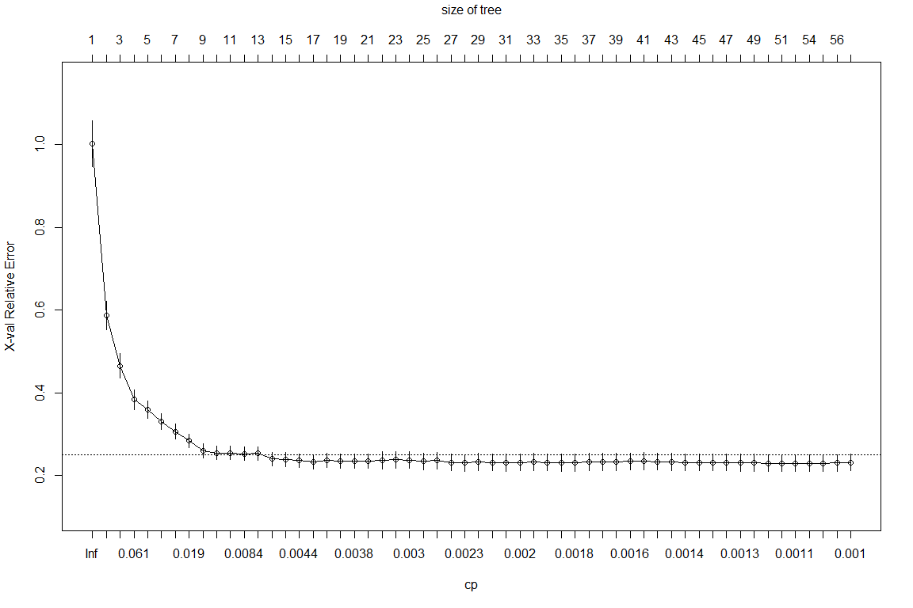
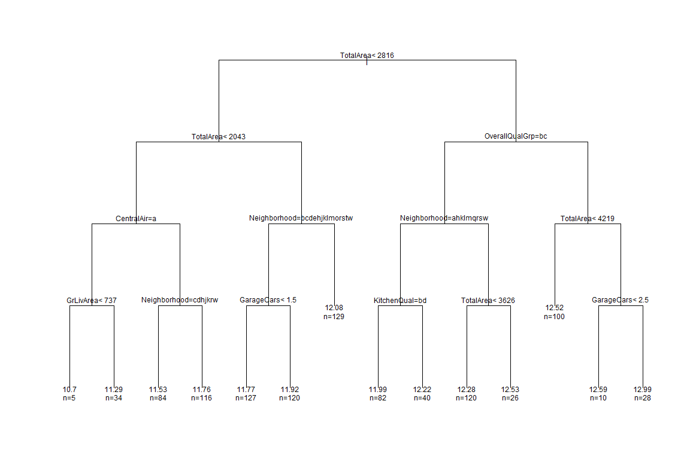
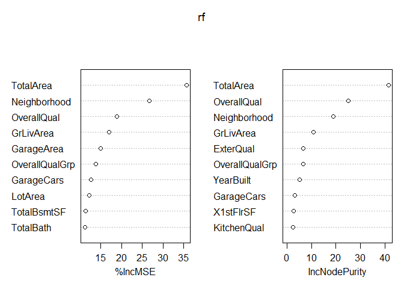
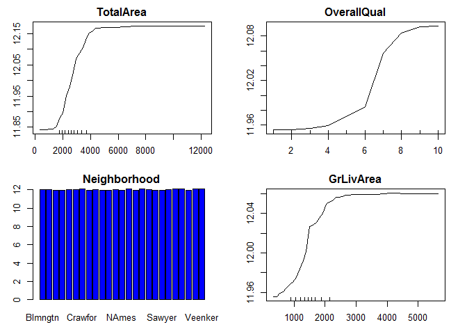
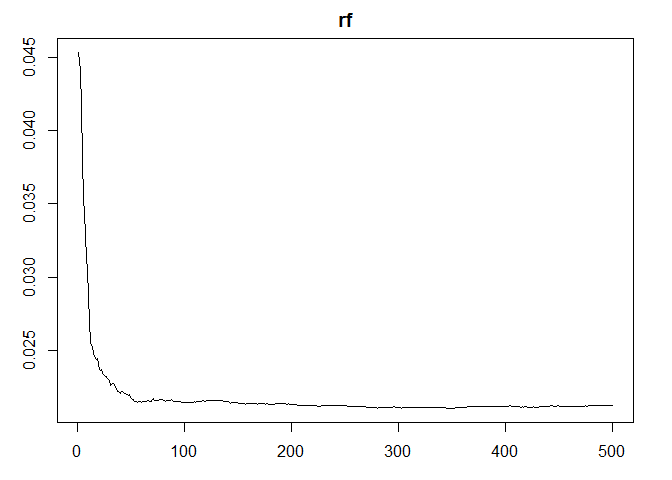
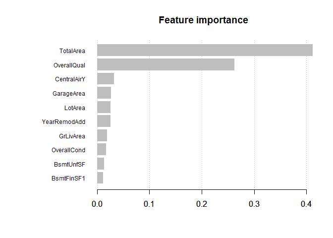

### Goal: analyze the house price dataset from Kaggle with tree based regression models and submit the result of predicted sale price for test data to Kaggle

### Step 1. Load dataset and take a look

    train <- read.csv("train.csv", stringsAsFactors = FALSE)
    test <- read.csv("test.csv", stringsAsFactors = FALSE)
    dim(train)

    ## [1] 1460   81

    dim(test) # test does not have sale price label

    ## [1] 1459   80

    str(train)

    ## 'data.frame':    1460 obs. of  81 variables:
    ##  $ Id           : int  1 2 3 4 5 6 7 8 9 10 ...
    ##  $ MSSubClass   : int  60 20 60 70 60 50 20 60 50 190 ...
    ##  $ MSZoning     : chr  "RL" "RL" "RL" "RL" ...
    ##  $ LotFrontage  : int  65 80 68 60 84 85 75 NA 51 50 ...
    ##  $ LotArea      : int  8450 9600 11250 9550 14260 14115 10084 10382 6120 7420 ...
    ##  $ Street       : chr  "Pave" "Pave" "Pave" "Pave" ...
    ##  $ Alley        : chr  NA NA NA NA ...
    ##  $ LotShape     : chr  "Reg" "Reg" "IR1" "IR1" ...
    ##  $ LandContour  : chr  "Lvl" "Lvl" "Lvl" "Lvl" ...
    ##  $ Utilities    : chr  "AllPub" "AllPub" "AllPub" "AllPub" ...
    ##  $ LotConfig    : chr  "Inside" "FR2" "Inside" "Corner" ...
    ##  $ LandSlope    : chr  "Gtl" "Gtl" "Gtl" "Gtl" ...
    ##  $ Neighborhood : chr  "CollgCr" "Veenker" "CollgCr" "Crawfor" ...
    ##  $ Condition1   : chr  "Norm" "Feedr" "Norm" "Norm" ...
    ##  $ Condition2   : chr  "Norm" "Norm" "Norm" "Norm" ...
    ##  $ BldgType     : chr  "1Fam" "1Fam" "1Fam" "1Fam" ...
    ##  $ HouseStyle   : chr  "2Story" "1Story" "2Story" "2Story" ...
    ##  $ OverallQual  : int  7 6 7 7 8 5 8 7 7 5 ...
    ##  $ OverallCond  : int  5 8 5 5 5 5 5 6 5 6 ...
    ##  $ YearBuilt    : int  2003 1976 2001 1915 2000 1993 2004 1973 1931 1939 ...
    ##  $ YearRemodAdd : int  2003 1976 2002 1970 2000 1995 2005 1973 1950 1950 ...
    ##  $ RoofStyle    : chr  "Gable" "Gable" "Gable" "Gable" ...
    ##  $ RoofMatl     : chr  "CompShg" "CompShg" "CompShg" "CompShg" ...
    ##  $ Exterior1st  : chr  "VinylSd" "MetalSd" "VinylSd" "Wd Sdng" ...
    ##  $ Exterior2nd  : chr  "VinylSd" "MetalSd" "VinylSd" "Wd Shng" ...
    ##  $ MasVnrType   : chr  "BrkFace" "None" "BrkFace" "None" ...
    ##  $ MasVnrArea   : int  196 0 162 0 350 0 186 240 0 0 ...
    ##  $ ExterQual    : chr  "Gd" "TA" "Gd" "TA" ...
    ##  $ ExterCond    : chr  "TA" "TA" "TA" "TA" ...
    ##  $ Foundation   : chr  "PConc" "CBlock" "PConc" "BrkTil" ...
    ##  $ BsmtQual     : chr  "Gd" "Gd" "Gd" "TA" ...
    ##  $ BsmtCond     : chr  "TA" "TA" "TA" "Gd" ...
    ##  $ BsmtExposure : chr  "No" "Gd" "Mn" "No" ...
    ##  $ BsmtFinType1 : chr  "GLQ" "ALQ" "GLQ" "ALQ" ...
    ##  $ BsmtFinSF1   : int  706 978 486 216 655 732 1369 859 0 851 ...
    ##  $ BsmtFinType2 : chr  "Unf" "Unf" "Unf" "Unf" ...
    ##  $ BsmtFinSF2   : int  0 0 0 0 0 0 0 32 0 0 ...
    ##  $ BsmtUnfSF    : int  150 284 434 540 490 64 317 216 952 140 ...
    ##  $ TotalBsmtSF  : int  856 1262 920 756 1145 796 1686 1107 952 991 ...
    ##  $ Heating      : chr  "GasA" "GasA" "GasA" "GasA" ...
    ##  $ HeatingQC    : chr  "Ex" "Ex" "Ex" "Gd" ...
    ##  $ CentralAir   : chr  "Y" "Y" "Y" "Y" ...
    ##  $ Electrical   : chr  "SBrkr" "SBrkr" "SBrkr" "SBrkr" ...
    ##  $ X1stFlrSF    : int  856 1262 920 961 1145 796 1694 1107 1022 1077 ...
    ##  $ X2ndFlrSF    : int  854 0 866 756 1053 566 0 983 752 0 ...
    ##  $ LowQualFinSF : int  0 0 0 0 0 0 0 0 0 0 ...
    ##  $ GrLivArea    : int  1710 1262 1786 1717 2198 1362 1694 2090 1774 1077 ...
    ##  $ BsmtFullBath : int  1 0 1 1 1 1 1 1 0 1 ...
    ##  $ BsmtHalfBath : int  0 1 0 0 0 0 0 0 0 0 ...
    ##  $ FullBath     : int  2 2 2 1 2 1 2 2 2 1 ...
    ##  $ HalfBath     : int  1 0 1 0 1 1 0 1 0 0 ...
    ##  $ BedroomAbvGr : int  3 3 3 3 4 1 3 3 2 2 ...
    ##  $ KitchenAbvGr : int  1 1 1 1 1 1 1 1 2 2 ...
    ##  $ KitchenQual  : chr  "Gd" "TA" "Gd" "Gd" ...
    ##  $ TotRmsAbvGrd : int  8 6 6 7 9 5 7 7 8 5 ...
    ##  $ Functional   : chr  "Typ" "Typ" "Typ" "Typ" ...
    ##  $ Fireplaces   : int  0 1 1 1 1 0 1 2 2 2 ...
    ##  $ FireplaceQu  : chr  NA "TA" "TA" "Gd" ...
    ##  $ GarageType   : chr  "Attchd" "Attchd" "Attchd" "Detchd" ...
    ##  $ GarageYrBlt  : int  2003 1976 2001 1998 2000 1993 2004 1973 1931 1939 ...
    ##  $ GarageFinish : chr  "RFn" "RFn" "RFn" "Unf" ...
    ##  $ GarageCars   : int  2 2 2 3 3 2 2 2 2 1 ...
    ##  $ GarageArea   : int  548 460 608 642 836 480 636 484 468 205 ...
    ##  $ GarageQual   : chr  "TA" "TA" "TA" "TA" ...
    ##  $ GarageCond   : chr  "TA" "TA" "TA" "TA" ...
    ##  $ PavedDrive   : chr  "Y" "Y" "Y" "Y" ...
    ##  $ WoodDeckSF   : int  0 298 0 0 192 40 255 235 90 0 ...
    ##  $ OpenPorchSF  : int  61 0 42 35 84 30 57 204 0 4 ...
    ##  $ EnclosedPorch: int  0 0 0 272 0 0 0 228 205 0 ...
    ##  $ X3SsnPorch   : int  0 0 0 0 0 320 0 0 0 0 ...
    ##  $ ScreenPorch  : int  0 0 0 0 0 0 0 0 0 0 ...
    ##  $ PoolArea     : int  0 0 0 0 0 0 0 0 0 0 ...
    ##  $ PoolQC       : chr  NA NA NA NA ...
    ##  $ Fence        : chr  NA NA NA NA ...
    ##  $ MiscFeature  : chr  NA NA NA NA ...
    ##  $ MiscVal      : int  0 0 0 0 0 700 0 350 0 0 ...
    ##  $ MoSold       : int  2 5 9 2 12 10 8 11 4 1 ...
    ##  $ YrSold       : int  2008 2007 2008 2006 2008 2009 2007 2009 2008 2008 ...
    ##  $ SaleType     : chr  "WD" "WD" "WD" "WD" ...
    ##  $ SaleCondition: chr  "Normal" "Normal" "Normal" "Abnorml" ...
    ##  $ SalePrice    : int  208500 181500 223500 140000 250000 143000 307000 200000 129900 118000 ...

    #combine train and test to process data together
    saleprice <- train$SalePrice
    train <- subset(train, select = -SalePrice) #remove label from train

    alldata <- rbind(train, test) 
    dim(alldata)

    ## [1] 2919   80

### Step 2. Data cleaning and feature engineering

#### 2.1 Some of the NA values in categorical dataset have meaning. For example, NA in Basement Quality means "no basement", rather than actual missing value. Use "No" as a new factor in these features so that R won't confuse it with actual NA

    # check which rows have missing values
    sort(sapply(alldata, function(x) sum(is.na(x))), decreasing = TRUE)

    ##        PoolQC   MiscFeature         Alley         Fence   FireplaceQu 
    ##          2909          2814          2721          2348          1420 
    ##   LotFrontage   GarageYrBlt  GarageFinish    GarageQual    GarageCond 
    ##           486           159           159           159           159 
    ##    GarageType      BsmtCond  BsmtExposure      BsmtQual  BsmtFinType2 
    ##           157            82            82            81            80 
    ##  BsmtFinType1    MasVnrType    MasVnrArea      MSZoning     Utilities 
    ##            79            24            23             4             2 
    ##  BsmtFullBath  BsmtHalfBath    Functional   Exterior1st   Exterior2nd 
    ##             2             2             2             1             1 
    ##    BsmtFinSF1    BsmtFinSF2     BsmtUnfSF   TotalBsmtSF    Electrical 
    ##             1             1             1             1             1 
    ##   KitchenQual    GarageCars    GarageArea      SaleType            Id 
    ##             1             1             1             1             0 
    ##    MSSubClass       LotArea        Street      LotShape   LandContour 
    ##             0             0             0             0             0 
    ##     LotConfig     LandSlope  Neighborhood    Condition1    Condition2 
    ##             0             0             0             0             0 
    ##      BldgType    HouseStyle   OverallQual   OverallCond     YearBuilt 
    ##             0             0             0             0             0 
    ##  YearRemodAdd     RoofStyle      RoofMatl     ExterQual     ExterCond 
    ##             0             0             0             0             0 
    ##    Foundation       Heating     HeatingQC    CentralAir     X1stFlrSF 
    ##             0             0             0             0             0 
    ##     X2ndFlrSF  LowQualFinSF     GrLivArea      FullBath      HalfBath 
    ##             0             0             0             0             0 
    ##  BedroomAbvGr  KitchenAbvGr  TotRmsAbvGrd    Fireplaces    PavedDrive 
    ##             0             0             0             0             0 
    ##    WoodDeckSF   OpenPorchSF EnclosedPorch    X3SsnPorch   ScreenPorch 
    ##             0             0             0             0             0 
    ##      PoolArea       MiscVal        MoSold        YrSold SaleCondition 
    ##             0             0             0             0             0

    # columes with meaningful NA value
    keep.na <- c("Alley", "BsmtQual", "BsmtCond", "BsmtExposure",
                 "BsmtFinType1", "BsmtFinType2", "FireplaceQu",
                 "GarageType", "GarageFinish", "GarageQual",
                 "GarageCond","PoolQC","Fence", "MiscFeature")

    # change NA in the above features to "No"
    for(i in 1:length(keep.na)){
      column <- keep.na[i]
      alldata[which(is.na(alldata[,column])), column] <- "No"
    }

    #check NA again. NA is greatly reduced 
    sort(sapply(alldata, function(x) sum(is.na(x))), decreasing = TRUE)

    ##   LotFrontage   GarageYrBlt    MasVnrType    MasVnrArea      MSZoning 
    ##           486           159            24            23             4 
    ##     Utilities  BsmtFullBath  BsmtHalfBath    Functional   Exterior1st 
    ##             2             2             2             2             1 
    ##   Exterior2nd    BsmtFinSF1    BsmtFinSF2     BsmtUnfSF   TotalBsmtSF 
    ##             1             1             1             1             1 
    ##    Electrical   KitchenQual    GarageCars    GarageArea      SaleType 
    ##             1             1             1             1             1 
    ##            Id    MSSubClass       LotArea        Street         Alley 
    ##             0             0             0             0             0 
    ##      LotShape   LandContour     LotConfig     LandSlope  Neighborhood 
    ##             0             0             0             0             0 
    ##    Condition1    Condition2      BldgType    HouseStyle   OverallQual 
    ##             0             0             0             0             0 
    ##   OverallCond     YearBuilt  YearRemodAdd     RoofStyle      RoofMatl 
    ##             0             0             0             0             0 
    ##     ExterQual     ExterCond    Foundation      BsmtQual      BsmtCond 
    ##             0             0             0             0             0 
    ##  BsmtExposure  BsmtFinType1  BsmtFinType2       Heating     HeatingQC 
    ##             0             0             0             0             0 
    ##    CentralAir     X1stFlrSF     X2ndFlrSF  LowQualFinSF     GrLivArea 
    ##             0             0             0             0             0 
    ##      FullBath      HalfBath  BedroomAbvGr  KitchenAbvGr  TotRmsAbvGrd 
    ##             0             0             0             0             0 
    ##    Fireplaces   FireplaceQu    GarageType  GarageFinish    GarageQual 
    ##             0             0             0             0             0 
    ##    GarageCond    PavedDrive    WoodDeckSF   OpenPorchSF EnclosedPorch 
    ##             0             0             0             0             0 
    ##    X3SsnPorch   ScreenPorch      PoolArea        PoolQC         Fence 
    ##             0             0             0             0             0 
    ##   MiscFeature       MiscVal        MoSold        YrSold SaleCondition 
    ##             0             0             0             0             0

#### 2.2 Variables with too many missing values are not helpful in making a prediction model. Remove variables with more than 5% missing value

    keep.col <- colnames(alldata)[which(sapply(alldata, function(x) sum(is.na(x))/length(x) < 0.05))]

    alldata <- alldata[,keep.col]
    dim(alldata)

    ## [1] 2919   78

    # Check left features with missing values 
    sort(sapply(alldata, function(x) sum(is.na(x))), decreasing = TRUE)

    ##    MasVnrType    MasVnrArea      MSZoning     Utilities  BsmtFullBath 
    ##            24            23             4             2             2 
    ##  BsmtHalfBath    Functional   Exterior1st   Exterior2nd    BsmtFinSF1 
    ##             2             2             1             1             1 
    ##    BsmtFinSF2     BsmtUnfSF   TotalBsmtSF    Electrical   KitchenQual 
    ##             1             1             1             1             1 
    ##    GarageCars    GarageArea      SaleType            Id    MSSubClass 
    ##             1             1             1             0             0 
    ##       LotArea        Street         Alley      LotShape   LandContour 
    ##             0             0             0             0             0 
    ##     LotConfig     LandSlope  Neighborhood    Condition1    Condition2 
    ##             0             0             0             0             0 
    ##      BldgType    HouseStyle   OverallQual   OverallCond     YearBuilt 
    ##             0             0             0             0             0 
    ##  YearRemodAdd     RoofStyle      RoofMatl     ExterQual     ExterCond 
    ##             0             0             0             0             0 
    ##    Foundation      BsmtQual      BsmtCond  BsmtExposure  BsmtFinType1 
    ##             0             0             0             0             0 
    ##  BsmtFinType2       Heating     HeatingQC    CentralAir     X1stFlrSF 
    ##             0             0             0             0             0 
    ##     X2ndFlrSF  LowQualFinSF     GrLivArea      FullBath      HalfBath 
    ##             0             0             0             0             0 
    ##  BedroomAbvGr  KitchenAbvGr  TotRmsAbvGrd    Fireplaces   FireplaceQu 
    ##             0             0             0             0             0 
    ##    GarageType  GarageFinish    GarageQual    GarageCond    PavedDrive 
    ##             0             0             0             0             0 
    ##    WoodDeckSF   OpenPorchSF EnclosedPorch    X3SsnPorch   ScreenPorch 
    ##             0             0             0             0             0 
    ##      PoolArea        PoolQC         Fence   MiscFeature       MiscVal 
    ##             0             0             0             0             0 
    ##        MoSold        YrSold SaleCondition 
    ##             0             0             0

#### 2.3 There are categories with only a few missing values. Check if they come from the same observations.

    for (i in 1:dim(alldata)[2]){
      if (sum(is.na(alldata[,i]))>0){
        print(names(alldata)[i])
        row.ind <- which(is.na(alldata[,i]))
        print(row.ind)
      }
    }

    ## [1] "MSZoning"
    ## [1] 1916 2217 2251 2905
    ## [1] "Utilities"
    ## [1] 1916 1946
    ## [1] "Exterior1st"
    ## [1] 2152
    ## [1] "Exterior2nd"
    ## [1] 2152
    ## [1] "MasVnrType"
    ##  [1]  235  530  651  937  974  978 1244 1279 1692 1707 1883 1993 2005 2042
    ## [15] 2312 2326 2341 2350 2369 2593 2611 2658 2687 2863
    ## [1] "MasVnrArea"
    ##  [1]  235  530  651  937  974  978 1244 1279 1692 1707 1883 1993 2005 2042
    ## [15] 2312 2326 2341 2350 2369 2593 2658 2687 2863
    ## [1] "BsmtFinSF1"
    ## [1] 2121
    ## [1] "BsmtFinSF2"
    ## [1] 2121
    ## [1] "BsmtUnfSF"
    ## [1] 2121
    ## [1] "TotalBsmtSF"
    ## [1] 2121
    ## [1] "Electrical"
    ## [1] 1380
    ## [1] "BsmtFullBath"
    ## [1] 2121 2189
    ## [1] "BsmtHalfBath"
    ## [1] 2121 2189
    ## [1] "KitchenQual"
    ## [1] 1556
    ## [1] "Functional"
    ## [1] 2217 2474
    ## [1] "GarageCars"
    ## [1] 2577
    ## [1] "GarageArea"
    ## [1] 2577
    ## [1] "SaleType"
    ## [1] 2490

    # check garage related NA due to no garage
    alldata[2577,] # id=2577

    ##        Id MSSubClass MSZoning LotArea Street Alley LotShape LandContour
    ## 2577 2577         70       RM    9060   Pave    No      Reg         Lvl
    ##      Utilities LotConfig LandSlope Neighborhood Condition1 Condition2
    ## 2577    AllPub    Inside       Gtl       IDOTRR       Norm       Norm
    ##      BldgType HouseStyle OverallQual OverallCond YearBuilt YearRemodAdd
    ## 2577     1Fam     2Story           5           6      1923         1999
    ##      RoofStyle RoofMatl Exterior1st Exterior2nd MasVnrType MasVnrArea
    ## 2577     Gable  CompShg     Wd Sdng     Plywood       None          0
    ##      ExterQual ExterCond Foundation BsmtQual BsmtCond BsmtExposure
    ## 2577        TA        TA     BrkTil       Gd       TA           No
    ##      BsmtFinType1 BsmtFinSF1 BsmtFinType2 BsmtFinSF2 BsmtUnfSF TotalBsmtSF
    ## 2577          ALQ        548          Unf          0       311         859
    ##      Heating HeatingQC CentralAir Electrical X1stFlrSF X2ndFlrSF
    ## 2577    GasA        Ex          Y      SBrkr       942       886
    ##      LowQualFinSF GrLivArea BsmtFullBath BsmtHalfBath FullBath HalfBath
    ## 2577            0      1828            0            0        2        0
    ##      BedroomAbvGr KitchenAbvGr KitchenQual TotRmsAbvGrd Functional
    ## 2577            3            1          Gd            6        Typ
    ##      Fireplaces FireplaceQu GarageType GarageFinish GarageCars GarageArea
    ## 2577          0          No     Detchd           No         NA         NA
    ##      GarageQual GarageCond PavedDrive WoodDeckSF OpenPorchSF EnclosedPorch
    ## 2577         No         No          Y        174           0           212
    ##      X3SsnPorch ScreenPorch PoolArea PoolQC Fence MiscFeature MiscVal
    ## 2577          0           0        0     No MnPrv          No       0
    ##      MoSold YrSold SaleType SaleCondition
    ## 2577      3   2007       WD        Alloca

    alldata[2577, c("GarageArea", "GarageCars")] <-0

    # check basement related NA due to no basement
    alldata[2121,] # id=2121

    ##        Id MSSubClass MSZoning LotArea Street Alley LotShape LandContour
    ## 2121 2121         20       RM    5940   Pave    No      IR1         Lvl
    ##      Utilities LotConfig LandSlope Neighborhood Condition1 Condition2
    ## 2121    AllPub       FR3       Gtl      BrkSide      Feedr       Norm
    ##      BldgType HouseStyle OverallQual OverallCond YearBuilt YearRemodAdd
    ## 2121     1Fam     1Story           4           7      1946         1950
    ##      RoofStyle RoofMatl Exterior1st Exterior2nd MasVnrType MasVnrArea
    ## 2121     Gable  CompShg     MetalSd      CBlock       None          0
    ##      ExterQual ExterCond Foundation BsmtQual BsmtCond BsmtExposure
    ## 2121        TA        TA      PConc       No       No           No
    ##      BsmtFinType1 BsmtFinSF1 BsmtFinType2 BsmtFinSF2 BsmtUnfSF TotalBsmtSF
    ## 2121           No         NA           No         NA        NA          NA
    ##      Heating HeatingQC CentralAir Electrical X1stFlrSF X2ndFlrSF
    ## 2121    GasA        TA          Y      FuseA       896         0
    ##      LowQualFinSF GrLivArea BsmtFullBath BsmtHalfBath FullBath HalfBath
    ## 2121            0       896           NA           NA        1        0
    ##      BedroomAbvGr KitchenAbvGr KitchenQual TotRmsAbvGrd Functional
    ## 2121            2            1          TA            4        Typ
    ##      Fireplaces FireplaceQu GarageType GarageFinish GarageCars GarageArea
    ## 2121          0          No     Detchd          Unf          1        280
    ##      GarageQual GarageCond PavedDrive WoodDeckSF OpenPorchSF EnclosedPorch
    ## 2121         TA         TA          Y          0           0             0
    ##      X3SsnPorch ScreenPorch PoolArea PoolQC Fence MiscFeature MiscVal
    ## 2121          0           0        0     No MnPrv          No       0
    ##      MoSold YrSold SaleType SaleCondition
    ## 2121      4   2008    ConLD       Abnorml

    alldata[2121, c("BsmtFinSF1", "BsmtFinSF2", "BsmtUnfSF", "TotalBsmtSF", "BsmtFullBath", "BsmtHalfBath")] <-0

    alldata[2189,] # id=2189

    ##        Id MSSubClass MSZoning LotArea Street Alley LotShape LandContour
    ## 2189 2189         20       RL   47007   Pave    No      IR1         Lvl
    ##      Utilities LotConfig LandSlope Neighborhood Condition1 Condition2
    ## 2189    AllPub    Inside       Gtl      Edwards       Norm       Norm
    ##      BldgType HouseStyle OverallQual OverallCond YearBuilt YearRemodAdd
    ## 2189     1Fam     1Story           5           7      1959         1996
    ##      RoofStyle RoofMatl Exterior1st Exterior2nd MasVnrType MasVnrArea
    ## 2189     Gable  CompShg     Plywood     Plywood       None          0
    ##      ExterQual ExterCond Foundation BsmtQual BsmtCond BsmtExposure
    ## 2189        TA        TA       Slab       No       No           No
    ##      BsmtFinType1 BsmtFinSF1 BsmtFinType2 BsmtFinSF2 BsmtUnfSF TotalBsmtSF
    ## 2189           No          0           No          0         0           0
    ##      Heating HeatingQC CentralAir Electrical X1stFlrSF X2ndFlrSF
    ## 2189    GasA        TA          Y      SBrkr      3820         0
    ##      LowQualFinSF GrLivArea BsmtFullBath BsmtHalfBath FullBath HalfBath
    ## 2189            0      3820           NA           NA        3        1
    ##      BedroomAbvGr KitchenAbvGr KitchenQual TotRmsAbvGrd Functional
    ## 2189            5            1          Ex           11        Typ
    ##      Fireplaces FireplaceQu GarageType GarageFinish GarageCars GarageArea
    ## 2189          2          Gd     Attchd          Unf          2        624
    ##      GarageQual GarageCond PavedDrive WoodDeckSF OpenPorchSF EnclosedPorch
    ## 2189         TA         TA          Y          0         372             0
    ##      X3SsnPorch ScreenPorch PoolArea PoolQC Fence MiscFeature MiscVal
    ## 2189          0           0        0     No    No          No       0
    ##      MoSold YrSold SaleType SaleCondition
    ## 2189      7   2008       WD        Normal

    alldata[2189, c("BsmtFullBath", "BsmtHalfBath")] <-0

    # check exterior 
    alldata[2152,] # id 2152. It will be imputed later with mice 

    ##        Id MSSubClass MSZoning LotArea Street Alley LotShape LandContour
    ## 2152 2152         30       RL   19550   Pave    No      Reg         Lvl
    ##      Utilities LotConfig LandSlope Neighborhood Condition1 Condition2
    ## 2152    AllPub    Inside       Gtl      Edwards       Norm       Norm
    ##      BldgType HouseStyle OverallQual OverallCond YearBuilt YearRemodAdd
    ## 2152     1Fam     1Story           5           7      1940         2007
    ##      RoofStyle RoofMatl Exterior1st Exterior2nd MasVnrType MasVnrArea
    ## 2152      Flat  Tar&Grv        <NA>        <NA>       None          0
    ##      ExterQual ExterCond Foundation BsmtQual BsmtCond BsmtExposure
    ## 2152        TA        TA      PConc       TA       TA           Gd
    ##      BsmtFinType1 BsmtFinSF1 BsmtFinType2 BsmtFinSF2 BsmtUnfSF TotalBsmtSF
    ## 2152          ALQ       1035          Unf          0       545        1580
    ##      Heating HeatingQC CentralAir Electrical X1stFlrSF X2ndFlrSF
    ## 2152    GasA        Ex          Y      SBrkr      1518         0
    ##      LowQualFinSF GrLivArea BsmtFullBath BsmtHalfBath FullBath HalfBath
    ## 2152            0      1518            1            0        1        0
    ##      BedroomAbvGr KitchenAbvGr KitchenQual TotRmsAbvGrd Functional
    ## 2152            2            1          Fa            5        Typ
    ##      Fireplaces FireplaceQu GarageType GarageFinish GarageCars GarageArea
    ## 2152          2          Gd         No           No          0          0
    ##      GarageQual GarageCond PavedDrive WoodDeckSF OpenPorchSF EnclosedPorch
    ## 2152         No         No          Y          0          39             0
    ##      X3SsnPorch ScreenPorch PoolArea PoolQC Fence MiscFeature MiscVal
    ## 2152          0           0        0     No    No          No       0
    ##      MoSold YrSold SaleType SaleCondition
    ## 2152      1   2008       WD        Normal

    # The rest of categorical and numerical features will be imputed with mice
    for (i in 1:dim(alldata)[2]){
      if (sum(is.na(alldata[,i]))>0){
        print(names(alldata)[i])
        row.ind <- which(is.na(alldata[,i]))
        print(row.ind)
      }
    }

    ## [1] "MSZoning"
    ## [1] 1916 2217 2251 2905
    ## [1] "Utilities"
    ## [1] 1916 1946
    ## [1] "Exterior1st"
    ## [1] 2152
    ## [1] "Exterior2nd"
    ## [1] 2152
    ## [1] "MasVnrType"
    ##  [1]  235  530  651  937  974  978 1244 1279 1692 1707 1883 1993 2005 2042
    ## [15] 2312 2326 2341 2350 2369 2593 2611 2658 2687 2863
    ## [1] "MasVnrArea"
    ##  [1]  235  530  651  937  974  978 1244 1279 1692 1707 1883 1993 2005 2042
    ## [15] 2312 2326 2341 2350 2369 2593 2658 2687 2863
    ## [1] "Electrical"
    ## [1] 1380
    ## [1] "KitchenQual"
    ## [1] 1556
    ## [1] "Functional"
    ## [1] 2217 2474
    ## [1] "SaleType"
    ## [1] 2490

#### 2.4 Use Mice library to impute missing values from similar observations

    library(mice)

    # convert categorical variables into factor to use mice

    imp.col <- names(alldata)[which(sapply(alldata, function(x) sum(is.na(x))>0))]
    summary(alldata[,imp.col]) # before 

    ##    MSZoning          Utilities         Exterior1st       
    ##  Length:2919        Length:2919        Length:2919       
    ##  Class :character   Class :character   Class :character  
    ##  Mode  :character   Mode  :character   Mode  :character  
    ##                                                          
    ##                                                          
    ##                                                          
    ##                                                          
    ##  Exterior2nd         MasVnrType          MasVnrArea      Electrical       
    ##  Length:2919        Length:2919        Min.   :   0.0   Length:2919       
    ##  Class :character   Class :character   1st Qu.:   0.0   Class :character  
    ##  Mode  :character   Mode  :character   Median :   0.0   Mode  :character  
    ##                                        Mean   : 102.2                     
    ##                                        3rd Qu.: 164.0                     
    ##                                        Max.   :1600.0                     
    ##                                        NA's   :23                         
    ##  KitchenQual         Functional          SaleType        
    ##  Length:2919        Length:2919        Length:2919       
    ##  Class :character   Class :character   Class :character  
    ##  Mode  :character   Mode  :character   Mode  :character  
    ##                                                          
    ##                                                          
    ##                                                          
    ## 

    for(i in 1:length(imp.col)){
      if (is.character(alldata[,imp.col[i]])){
        alldata[,imp.col[i]] <- as.factor(alldata[,imp.col[i]])
      }
    } 
      
    summary(alldata[,imp.col]) # after 

    ##     MSZoning     Utilities     Exterior1st    Exterior2nd     MasVnrType  
    ##  C (all):  25   AllPub:2916   VinylSd:1025   VinylSd:1014   BrkCmn :  25  
    ##  FV     : 139   NoSeWa:   1   MetalSd: 450   MetalSd: 447   BrkFace: 879  
    ##  RH     :  26   NA's  :   2   HdBoard: 442   HdBoard: 406   None   :1742  
    ##  RL     :2265                 Wd Sdng: 411   Wd Sdng: 391   Stone  : 249  
    ##  RM     : 460                 Plywood: 221   Plywood: 270   NA's   :  24  
    ##  NA's   :   4                 (Other): 369   (Other): 390                 
    ##                               NA's   :   1   NA's   :   1                 
    ##    MasVnrArea     Electrical   KitchenQual   Functional      SaleType   
    ##  Min.   :   0.0   FuseA: 188   Ex  : 205   Typ    :2717   WD     :2525  
    ##  1st Qu.:   0.0   FuseF:  50   Fa  :  70   Min2   :  70   New    : 239  
    ##  Median :   0.0   FuseP:   8   Gd  :1151   Min1   :  65   COD    :  87  
    ##  Mean   : 102.2   Mix  :   1   TA  :1492   Mod    :  35   ConLD  :  26  
    ##  3rd Qu.: 164.0   SBrkr:2671   NA's:   1   Maj1   :  19   CWD    :  12  
    ##  Max.   :1600.0   NA's :   1               (Other):  11   (Other):  29  
    ##  NA's   :23                                NA's   :   2   NA's   :   1

    # impute NA with mice
    imp.alldata <- mice(alldata, m = 1, method = "cart", seed =1, printFlag = FALSE)
    alldata <- complete(imp.alldata)

    # NA is all gone
    sum(is.na(alldata))

    ## [1] 0

    summary(alldata[,imp.col])

    ##     MSZoning     Utilities     Exterior1st    Exterior2nd     MasVnrType  
    ##  C (all):  25   AllPub:2918   VinylSd:1025   VinylSd:1014   BrkCmn :  25  
    ##  FV     : 139   NoSeWa:   1   MetalSd: 451   MetalSd: 448   BrkFace: 886  
    ##  RH     :  26                 HdBoard: 442   HdBoard: 406   None   :1756  
    ##  RL     :2268                 Wd Sdng: 411   Wd Sdng: 391   Stone  : 252  
    ##  RM     : 461                 Plywood: 221   Plywood: 270                 
    ##                               CemntBd: 126   CmentBd: 126                 
    ##                               (Other): 243   (Other): 264                 
    ##    MasVnrArea     Electrical   KitchenQual Functional     SaleType   
    ##  Min.   :   0.0   FuseA: 188   Ex: 205     Maj1:  19   WD     :2526  
    ##  1st Qu.:   0.0   FuseF:  50   Fa:  70     Maj2:   9   New    : 239  
    ##  Median :   0.0   FuseP:   8   Gd:1151     Min1:  65   COD    :  87  
    ##  Mean   : 102.4   Mix  :   1   TA:1493     Min2:  70   ConLD  :  26  
    ##  3rd Qu.: 164.0   SBrkr:2672               Mod :  35   CWD    :  12  
    ##  Max.   :1600.0                            Sev :   2   ConLI  :   9  
    ##                                            Typ :2719   (Other):  20

#### 2.5 Feature engineering

    # 1. Create the total number of bathrooms 

    alldata$TotalBath <- with(alldata, FullBath + 0.5*HalfBath + BsmtFullBath + 0.5*BsmtHalfBath )

    # 2. Current overall quality and condition has 10 ratings. Divide them into 3 groups 

    alldata$OverallQualGrp <- cut(alldata$OverallQual, breaks = 3, labels = c("low", "medium", "high"))
    table(alldata$OverallQualGrp)

    ## 
    ##    low medium   high 
    ##    283   2156    480

    alldata$OverallCondGrp <- cut(alldata$OverallCond, breaks = 3, labels = c("low", "medium", "high"))
    table(alldata$OverallCondGrp)

    ## 
    ##    low medium   high 
    ##     67   2277    575

    # 3. Create the total living area of the house 

    alldata$TotalArea <- with(alldata,TotalBsmtSF+X1stFlrSF+X2ndFlrSF+WoodDeckSF+OpenPorchSF)

    # Current features 
    names(alldata)

    ##  [1] "Id"             "MSSubClass"     "MSZoning"       "LotArea"       
    ##  [5] "Street"         "Alley"          "LotShape"       "LandContour"   
    ##  [9] "Utilities"      "LotConfig"      "LandSlope"      "Neighborhood"  
    ## [13] "Condition1"     "Condition2"     "BldgType"       "HouseStyle"    
    ## [17] "OverallQual"    "OverallCond"    "YearBuilt"      "YearRemodAdd"  
    ## [21] "RoofStyle"      "RoofMatl"       "Exterior1st"    "Exterior2nd"   
    ## [25] "MasVnrType"     "MasVnrArea"     "ExterQual"      "ExterCond"     
    ## [29] "Foundation"     "BsmtQual"       "BsmtCond"       "BsmtExposure"  
    ## [33] "BsmtFinType1"   "BsmtFinSF1"     "BsmtFinType2"   "BsmtFinSF2"    
    ## [37] "BsmtUnfSF"      "TotalBsmtSF"    "Heating"        "HeatingQC"     
    ## [41] "CentralAir"     "Electrical"     "X1stFlrSF"      "X2ndFlrSF"     
    ## [45] "LowQualFinSF"   "GrLivArea"      "BsmtFullBath"   "BsmtHalfBath"  
    ## [49] "FullBath"       "HalfBath"       "BedroomAbvGr"   "KitchenAbvGr"  
    ## [53] "KitchenQual"    "TotRmsAbvGrd"   "Functional"     "Fireplaces"    
    ## [57] "FireplaceQu"    "GarageType"     "GarageFinish"   "GarageCars"    
    ## [61] "GarageArea"     "GarageQual"     "GarageCond"     "PavedDrive"    
    ## [65] "WoodDeckSF"     "OpenPorchSF"    "EnclosedPorch"  "X3SsnPorch"    
    ## [69] "ScreenPorch"    "PoolArea"       "PoolQC"         "Fence"         
    ## [73] "MiscFeature"    "MiscVal"        "MoSold"         "YrSold"        
    ## [77] "SaleType"       "SaleCondition"  "TotalBath"      "OverallQualGrp"
    ## [81] "OverallCondGrp" "TotalArea"

    # save cleaned train and test data into separately
    train <- alldata[1:dim(train)[1],]
    test <- alldata[(dim(train)[1]+1):dim(alldata)[1],]
    train <- cbind(train, saleprice)
    write.csv(train, "train_clean.csv", row.names = FALSE)
    write.csv(test,"test_clean.csv", row.names = FALSE)

### Step 3. Build regression tree to prediction of sale price

    library(caTools)
    library(rpart)

    #separate train and test set
    train <- read.csv("train_clean.csv")
    train <- subset(train, select = -Id)
    names(train)

    ##  [1] "MSSubClass"     "MSZoning"       "LotArea"        "Street"        
    ##  [5] "Alley"          "LotShape"       "LandContour"    "Utilities"     
    ##  [9] "LotConfig"      "LandSlope"      "Neighborhood"   "Condition1"    
    ## [13] "Condition2"     "BldgType"       "HouseStyle"     "OverallQual"   
    ## [17] "OverallCond"    "YearBuilt"      "YearRemodAdd"   "RoofStyle"     
    ## [21] "RoofMatl"       "Exterior1st"    "Exterior2nd"    "MasVnrType"    
    ## [25] "MasVnrArea"     "ExterQual"      "ExterCond"      "Foundation"    
    ## [29] "BsmtQual"       "BsmtCond"       "BsmtExposure"   "BsmtFinType1"  
    ## [33] "BsmtFinSF1"     "BsmtFinType2"   "BsmtFinSF2"     "BsmtUnfSF"     
    ## [37] "TotalBsmtSF"    "Heating"        "HeatingQC"      "CentralAir"    
    ## [41] "Electrical"     "X1stFlrSF"      "X2ndFlrSF"      "LowQualFinSF"  
    ## [45] "GrLivArea"      "BsmtFullBath"   "BsmtHalfBath"   "FullBath"      
    ## [49] "HalfBath"       "BedroomAbvGr"   "KitchenAbvGr"   "KitchenQual"   
    ## [53] "TotRmsAbvGrd"   "Functional"     "Fireplaces"     "FireplaceQu"   
    ## [57] "GarageType"     "GarageFinish"   "GarageCars"     "GarageArea"    
    ## [61] "GarageQual"     "GarageCond"     "PavedDrive"     "WoodDeckSF"    
    ## [65] "OpenPorchSF"    "EnclosedPorch"  "X3SsnPorch"     "ScreenPorch"   
    ## [69] "PoolArea"       "PoolQC"         "Fence"          "MiscFeature"   
    ## [73] "MiscVal"        "MoSold"         "YrSold"         "SaleType"      
    ## [77] "SaleCondition"  "TotalBath"      "OverallQualGrp" "OverallCondGrp"
    ## [81] "TotalArea"      "saleprice"

    set.seed(100)
    spl <- sample.split(train[,1], SplitRatio = 0.7)
    train.x <- subset(train, select = -saleprice)[spl,]
    train.y <- train$saleprice[spl]
    train.xy <- train[spl,]
    test.x <- subset(train, select = -saleprice)[!spl,]
    test.y <- train$saleprice[!spl]
    test.xy <- train[!spl,]
    dim(train.xy); dim(test.x)

    ## [1] 1021   82

    ## [1] 439  81

    #use rpart to grow a tree
    formula <- paste("log(saleprice) ~ .-saleprice")
    set.seed(200)
    tree <- rpart(formula, data = train.xy, method = "anova",
                  control = rpart.control(minsplit = 10, cp=0.001))

    #examine the tree
    printcp(tree)

    ## 
    ## Regression tree:
    ## rpart(formula = formula, data = train.xy, method = "anova", control = rpart.control(minsplit = 10, 
    ##     cp = 0.001))
    ## 
    ## Variables actually used in tree construction:
    ##  [1] BsmtFinSF1     BsmtFinType1   BsmtFinType2   BsmtQual      
    ##  [5] CentralAir     Condition1     Exterior1st    Exterior2nd   
    ##  [9] FireplaceQu    GarageArea     GarageCars     GarageType    
    ## [13] GrLivArea      KitchenQual    MasVnrType     MSSubClass    
    ## [17] Neighborhood   OverallCond    OverallQual    OverallQualGrp
    ## [21] SaleCondition  TotalArea      TotalBath      X1stFlrSF     
    ## [25] YearRemodAdd  
    ## 
    ## Root node error: 163.55/1021 = 0.16019
    ## 
    ## n= 1021 
    ## 
    ##           CP nsplit rel error  xerror     xstd
    ## 1  0.4526540      0  1.000000 1.00227 0.055054
    ## 2  0.1006477      1  0.547346 0.58707 0.035023
    ## 3  0.0952671      2  0.446698 0.46540 0.028847
    ## 4  0.0395752      3  0.351431 0.38346 0.023852
    ## 5  0.0281576      4  0.311856 0.35909 0.021719
    ## 6  0.0269056      5  0.283698 0.33029 0.019126
    ## 7  0.0231110      6  0.256793 0.30637 0.018671
    ## 8  0.0160682      7  0.233682 0.28356 0.017048
    ## 9  0.0092857      8  0.217614 0.25958 0.016424
    ## 10 0.0088179      9  0.208328 0.25480 0.016163
    ## 11 0.0086871     10  0.199510 0.25445 0.016172
    ## 12 0.0082103     11  0.190823 0.25223 0.016181
    ## 13 0.0073027     12  0.182613 0.25289 0.016467
    ## 14 0.0057930     13  0.175310 0.24022 0.016079
    ## 15 0.0044310     14  0.169517 0.23858 0.016563
    ## 16 0.0043002     15  0.165086 0.23591 0.016424
    ## 17 0.0039669     16  0.160786 0.23268 0.016820
    ## 18 0.0038785     17  0.156819 0.23619 0.017354
    ## 19 0.0038755     18  0.152940 0.23548 0.017332
    ## 20 0.0037872     19  0.149065 0.23504 0.017327
    ## 21 0.0033021     20  0.145278 0.23551 0.017374
    ## 22 0.0032576     21  0.141975 0.23661 0.020258
    ## 23 0.0031833     22  0.138718 0.23776 0.020279
    ## 24 0.0028925     23  0.135535 0.23693 0.020253
    ## 25 0.0027428     24  0.132642 0.23414 0.020217
    ## 26 0.0024811     25  0.129899 0.23579 0.020244
    ## 27 0.0023202     26  0.127418 0.23123 0.020090
    ## 28 0.0022385     27  0.125098 0.23062 0.020204
    ## 29 0.0021723     28  0.122859 0.23266 0.020754
    ## 30 0.0020905     29  0.120687 0.23180 0.020728
    ## 31 0.0019770     30  0.118597 0.23056 0.020708
    ## 32 0.0019612     31  0.116620 0.23163 0.020807
    ## 33 0.0018568     32  0.114658 0.23220 0.020811
    ## 34 0.0018371     33  0.112802 0.23162 0.020805
    ## 35 0.0017944     34  0.110964 0.23146 0.020805
    ## 36 0.0017574     35  0.109170 0.23130 0.020807
    ## 37 0.0016784     36  0.107413 0.23229 0.020810
    ## 38 0.0016643     37  0.105734 0.23229 0.020807
    ## 39 0.0015774     38  0.104070 0.23293 0.020841
    ## 40 0.0015269     39  0.102492 0.23394 0.020774
    ## 41 0.0015066     40  0.100966 0.23459 0.020789
    ## 42 0.0014403     41  0.099459 0.23373 0.020768
    ## 43 0.0014154     42  0.098019 0.23311 0.020776
    ## 44 0.0013905     43  0.096603 0.23153 0.020707
    ## 45 0.0013735     44  0.095213 0.23164 0.020695
    ## 46 0.0013681     45  0.093839 0.23164 0.020695
    ## 47 0.0013491     46  0.092471 0.23147 0.020690
    ## 48 0.0013126     47  0.091122 0.23123 0.020640
    ## 49 0.0012555     48  0.089810 0.23052 0.020636
    ## 50 0.0011222     49  0.088554 0.22959 0.020638
    ## 51 0.0011129     50  0.087432 0.22980 0.020570
    ## 52 0.0011004     52  0.085206 0.22972 0.020571
    ## 53 0.0010390     53  0.084106 0.22962 0.020485
    ## 54 0.0010067     54  0.083066 0.22959 0.020206
    ## 55 0.0010014     55  0.082060 0.23050 0.020231
    ## 56 0.0010000     56  0.081058 0.23104 0.020235

    plotcp(tree)

    #prune the tree
    cp.table <- as.data.frame(tree$cptable)
    best.cp <- cp.table$CP[min(which(with(cp.table, (xerror - xstd) <= min(xerror))))]
    best.cp

    ## [1] 0.005793032

    tree.pruned <- prune(tree, best.cp)
    plot(tree.pruned, uniform = TRUE)
    text(tree.pruned, cex = 0.75, use.n = TRUE, xpd = TRUE)

    #predict test data and calculate MSE
    test.predict <- predict(tree.pruned, test.xy)
    (sum(test.predict-log(test.y))^2)/length(test.predict) #MSE 0.04939179

    ## [1] 0.04939179

### Step 4. Build random forest

    library(randomForest)

    set.seed(100)
    rf <- randomForest(log(saleprice) ~ .-saleprice, data = train.xy, 
                       maxnodes = 50,
                       ntree = 500, importance = TRUE)

    mean(rf$mse) # the average MSE 0.02168123

    ## [1] 0.02168123

    getTree(rf, k=100, labelVar = TRUE) # see an example of a random tree. tree has many nodes. there may be overfitting

    ##    left daughter right daughter      split var split point status
    ## 1              2              3    OverallQual        6.50     -3
    ## 2              4              5     GarageCars        1.50     -3
    ## 3              6              7    OverallQual        7.50     -3
    ## 4              8              9      X1stFlrSF      660.50     -3
    ## 5             10             11      TotalArea     2216.00     -3
    ## 6             12             13      TotalArea     2822.00     -3
    ## 7             14             15     MasVnrArea      411.00     -3
    ## 8             16             17     MSSubClass       25.00     -3
    ## 9             18             19     GarageArea      170.00     -3
    ## 10            20             21       MSZoning        1.00     -3
    ## 11            22             23      GrLivArea     1373.00     -3
    ## 12            24             25      TotalBath        2.25     -3
    ## 13            26             27      BsmtUnfSF      256.00     -3
    ## 14            28             29      TotalArea     3081.00     -3
    ## 15            30             31     GarageArea     1319.00     -3
    ## 16             0              0           <NA>        0.00     -1
    ## 17            32             33     MasVnrArea       79.00     -3
    ## 18            34             35    Exterior2nd        1.00     -3
    ## 19            36             37   Neighborhood   656008.00     -3
    ## 20             0              0           <NA>        0.00     -1
    ## 21            38             39     BsmtFinSF1      174.00     -3
    ## 22            40             41   Neighborhood 32473071.00     -3
    ## 23            42             43   Neighborhood  2553351.00     -3
    ## 24            44             45   Neighborhood   131720.00     -3
    ## 25            46             47    Exterior1st     4063.00     -3
    ## 26            48             49    Exterior2nd    49015.00     -3
    ## 27            50             51     MasVnrArea      302.50     -3
    ## 28            52             53     Foundation       59.00     -3
    ## 29            54             55   BsmtFinType2      126.00     -3
    ## 30            56             57      TotalArea     3996.50     -3
    ## 31             0              0           <NA>        0.00     -1
    ## 32            58             59      HeatingQC        2.00     -3
    ## 33             0              0           <NA>        0.00     -1
    ## 34             0              0           <NA>        0.00     -1
    ## 35            60             61          Alley        3.00     -3
    ## 36            62             63    OverallCond        3.50     -3
    ## 37            64             65      TotalArea     2253.00     -3
    ## 38            66             67    Exterior1st    10573.00     -3
    ## 39            68             69 OverallQualGrp        2.00     -3
    ## 40            70             71   Neighborhood   410884.00     -3
    ## 41             0              0           <NA>        0.00     -1
    ## 42            72             73        LotArea    25110.00     -3
    ## 43            74             75      TotalArea     2764.00     -3
    ## 44            76             77      BsmtUnfSF      741.50     -3
    ## 45            78             79        LotArea    10901.50     -3
    ## 46            80             81   TotRmsAbvGrd        5.00     -3
    ## 47            82             83      GrLivArea     1501.50     -3
    ## 48            84             85      HeatingQC       14.00     -3
    ## 49            86             87       BsmtQual       26.00     -3
    ## 50            88             89      ExterQual       10.00     -3
    ## 51            90             91    OpenPorchSF      101.50     -3
    ## 52             0              0           <NA>        0.00     -1
    ## 53            92             93    KitchenQual       14.00     -3
    ## 54            94             95    Exterior1st     8151.00     -3
    ## 55             0              0           <NA>        0.00     -1
    ## 56            96             97      TotalArea     3718.50     -3
    ## 57            98             99      GrLivArea     3881.50     -3
    ## 58             0              0           <NA>        0.00     -1
    ## 59             0              0           <NA>        0.00     -1
    ## 60             0              0           <NA>        0.00     -1
    ## 61             0              0           <NA>        0.00     -1
    ## 62             0              0           <NA>        0.00     -1
    ## 63             0              0           <NA>        0.00     -1
    ## 64             0              0           <NA>        0.00     -1
    ## 65             0              0           <NA>        0.00     -1
    ## 66             0              0           <NA>        0.00     -1
    ## 67             0              0           <NA>        0.00     -1
    ## 68             0              0           <NA>        0.00     -1
    ## 69             0              0           <NA>        0.00     -1
    ## 70             0              0           <NA>        0.00     -1
    ## 71             0              0           <NA>        0.00     -1
    ## 72             0              0           <NA>        0.00     -1
    ## 73             0              0           <NA>        0.00     -1
    ## 74             0              0           <NA>        0.00     -1
    ## 75             0              0           <NA>        0.00     -1
    ## 76             0              0           <NA>        0.00     -1
    ## 77             0              0           <NA>        0.00     -1
    ## 78             0              0           <NA>        0.00     -1
    ## 79             0              0           <NA>        0.00     -1
    ## 80             0              0           <NA>        0.00     -1
    ## 81             0              0           <NA>        0.00     -1
    ## 82             0              0           <NA>        0.00     -1
    ## 83             0              0           <NA>        0.00     -1
    ## 84             0              0           <NA>        0.00     -1
    ## 85             0              0           <NA>        0.00     -1
    ## 86             0              0           <NA>        0.00     -1
    ## 87             0              0           <NA>        0.00     -1
    ## 88             0              0           <NA>        0.00     -1
    ## 89             0              0           <NA>        0.00     -1
    ## 90             0              0           <NA>        0.00     -1
    ## 91             0              0           <NA>        0.00     -1
    ## 92             0              0           <NA>        0.00     -1
    ## 93             0              0           <NA>        0.00     -1
    ## 94             0              0           <NA>        0.00     -1
    ## 95             0              0           <NA>        0.00     -1
    ## 96             0              0           <NA>        0.00     -1
    ## 97             0              0           <NA>        0.00     -1
    ## 98             0              0           <NA>        0.00     -1
    ## 99             0              0           <NA>        0.00     -1
    ##    prediction
    ## 1    12.02595
    ## 2    11.82261
    ## 3    12.38371
    ## 4    11.67552
    ## 5    11.94911
    ## 6    12.22664
    ## 7    12.62199
    ## 8    11.28847
    ## 9    11.71521
    ## 10   11.73274
    ## 11   12.06783
    ## 12   12.05874
    ## 13   12.32428
    ## 14   12.53339
    ## 15   12.78875
    ## 16   10.50763
    ## 17   11.38217
    ## 18   11.48061
    ## 19   11.75549
    ## 20   11.03306
    ## 21   11.75606
    ## 22   11.95898
    ## 23   12.11178
    ## 24   11.95592
    ## 25   12.13530
    ## 26   12.51670
    ## 27   12.28481
    ## 28   12.29735
    ## 29   12.58419
    ## 30   12.80487
    ## 31   11.98293
    ## 32   11.31448
    ## 33   11.65292
    ## 34   10.91509
    ## 35   11.52646
    ## 36   11.66924
    ## 37   11.83131
    ## 38   11.62136
    ## 39   11.83405
    ## 40   11.93625
    ## 41   12.23168
    ## 42   11.96021
    ## 43   12.16189
    ## 44   11.79121
    ## 45   12.01294
    ## 46   12.02834
    ## 47   12.20169
    ## 48   12.42477
    ## 49   12.66993
    ## 50   12.24278
    ## 51   12.43946
    ## 52   12.00762
    ## 53   12.31546
    ## 54   12.56750
    ## 55   13.22672
    ## 56   12.63071
    ## 57   12.93099
    ## 58   11.13459
    ## 59   11.33447
    ## 60   11.50758
    ## 61   12.20607
    ## 62   11.21930
    ## 63   11.68638
    ## 64   11.76146
    ## 65   11.91079
    ## 66   11.49820
    ## 67   11.76915
    ## 68   11.70222
    ## 69   11.84956
    ## 70   11.83549
    ## 71   11.97609
    ## 72   11.93442
    ## 73   12.27839
    ## 74   12.07969
    ## 75   12.21977
    ## 76   11.83923
    ## 77   11.75278
    ## 78   11.97440
    ## 79   12.17483
    ## 80   11.90976
    ## 81   12.06222
    ## 82   12.12930
    ## 83   12.25279
    ## 84   12.34830
    ## 85   12.46300
    ## 86   12.57847
    ## 87   12.74310
    ## 88   12.11314
    ## 89   12.28854
    ## 90   12.36757
    ## 91   12.66710
    ## 92   12.28835
    ## 93   12.50525
    ## 94   12.53303
    ## 95   12.68916
    ## 96   12.55630
    ## 97   12.71256
    ## 98   12.90944
    ## 99   13.53447

    varImpPlot(rf, n.var = 10) # plot for % increase of MSE and Node purity for each feature

    importance.order <- order(-rf$importance[, "%IncMSE"])
    names <- rownames(rf$importance)[importance.order]

    #partial plot to check the marginal effect of top 4 features on response
    par(mfrow = c(2, 2))
    par(mar=c(3,3,2,2))
    for (name in names[1:4]){
      partialPlot(rf, train.xy, eval(name), main = name, xlab = name)
    }

    # plot the error over ntree
    par(mfrow = c(1,1))
    plot(rf)

    #predict test data and calculate MSE
    test.predict <- predict(rf, test.xy)
    (sum(test.predict-log(test.y))^2)/length(test.predict) #MSE 0.00972537

    ## [1] 0.00972537

    ################### tune random forest model ####################

    ntree <- c(500, 700, 800)
    maxnodes <- c(20,40,60)
    model.mse <- NULL 
    ntree.model <- NULL
    maxnodes.model <- NULL
    test.mse <- NULL

    for (n in ntree){
      for (m in maxnodes){
        set.seed(100)
        rf.tune <- randomForest(log(saleprice) ~ .-saleprice, data = train.xy, 
                       ntree = n, maxnodes=m)
        mse <- mean(rf.tune$mse)
        model.mse <- c(model.mse, mse)
        ntree.model <- c(ntree.model, n)
        maxnodes.model <- c(maxnodes.model,m)
        test.predict <- predict(rf.tune, test.xy)
        test.mse <- c(test.mse, (sum(test.predict-log(test.y))^2)/length(test.predict))
        
      }
    }

    tune.res <- data.frame(ntree.model, maxnodes.model, mse, test.mse)
    ind <- which.min(tune.res$test.mse)
    tune.res[ind,] #at best parameters test MSE 0.003258348

    ##   ntree.model maxnodes.model        mse    test.mse
    ## 2         500             40 0.02120388 0.003258348

### Step 5. Build gradient boosting model

    library(xgboost)

    #make numeric matrix
    feature.matrix <- model.matrix(~., data = train.x)
    feature.matrix.test <- model.matrix(~., data = test.x)
    dim(feature.matrix)

    ## [1] 1021  263

    set.seed(100)
    gbt <- xgboost(data =  feature.matrix, 
                   label = log(train.y), 
                   max_depth = 8, # for each tree, how deep it goes
                   nrounds = 100, # number of trees
                   objective = "reg:linear",
                   verbose = 1)

    ## [1]  train-rmse:8.073181 
    ## [2]  train-rmse:5.659934 
    ## [3]  train-rmse:3.969980 
    ## [4]  train-rmse:2.787562 
    ## [5]  train-rmse:1.960154 
    ## [6]  train-rmse:1.380936 
    ## [7]  train-rmse:0.975815 
    ## [8]  train-rmse:0.692888 
    ## [9]  train-rmse:0.495301 
    ## [10] train-rmse:0.357485 
    ## [11] train-rmse:0.261100 
    ## [12] train-rmse:0.193116 
    ## [13] train-rmse:0.146894 
    ## [14] train-rmse:0.113727 
    ## [15] train-rmse:0.090150 
    ## [16] train-rmse:0.073434 
    ## [17] train-rmse:0.062440 
    ## [18] train-rmse:0.055097 
    ## [19] train-rmse:0.049457 
    ## [20] train-rmse:0.044993 
    ## [21] train-rmse:0.042370 
    ## [22] train-rmse:0.039028 
    ## [23] train-rmse:0.035224 
    ## [24] train-rmse:0.032520 
    ## [25] train-rmse:0.030615 
    ## [26] train-rmse:0.029008 
    ## [27] train-rmse:0.026126 
    ## [28] train-rmse:0.024740 
    ## [29] train-rmse:0.023437 
    ## [30] train-rmse:0.022154 
    ## [31] train-rmse:0.021495 
    ## [32] train-rmse:0.020861 
    ## [33] train-rmse:0.020165 
    ## [34] train-rmse:0.019542 
    ## [35] train-rmse:0.018843 
    ## [36] train-rmse:0.017653 
    ## [37] train-rmse:0.016676 
    ## [38] train-rmse:0.015894 
    ## [39] train-rmse:0.015432 
    ## [40] train-rmse:0.014960 
    ## [41] train-rmse:0.013834 
    ## [42] train-rmse:0.012965 
    ## [43] train-rmse:0.012725 
    ## [44] train-rmse:0.012426 
    ## [45] train-rmse:0.011534 
    ## [46] train-rmse:0.010615 
    ## [47] train-rmse:0.010175 
    ## [48] train-rmse:0.009699 
    ## [49] train-rmse:0.009577 
    ## [50] train-rmse:0.009455 
    ## [51] train-rmse:0.008876 
    ## [52] train-rmse:0.008680 
    ## [53] train-rmse:0.008410 
    ## [54] train-rmse:0.008159 
    ## [55] train-rmse:0.008050 
    ## [56] train-rmse:0.007716 
    ## [57] train-rmse:0.007488 
    ## [58] train-rmse:0.006856 
    ## [59] train-rmse:0.006571 
    ## [60] train-rmse:0.006433 
    ## [61] train-rmse:0.006252 
    ## [62] train-rmse:0.006106 
    ## [63] train-rmse:0.005899 
    ## [64] train-rmse:0.005516 
    ## [65] train-rmse:0.005136 
    ## [66] train-rmse:0.004833 
    ## [67] train-rmse:0.004674 
    ## [68] train-rmse:0.004459 
    ## [69] train-rmse:0.004269 
    ## [70] train-rmse:0.003920 
    ## [71] train-rmse:0.003610 
    ## [72] train-rmse:0.003527 
    ## [73] train-rmse:0.003251 
    ## [74] train-rmse:0.003083 
    ## [75] train-rmse:0.003042 
    ## [76] train-rmse:0.002920 
    ## [77] train-rmse:0.002664 
    ## [78] train-rmse:0.002625 
    ## [79] train-rmse:0.002583 
    ## [80] train-rmse:0.002562 
    ## [81] train-rmse:0.002481 
    ## [82] train-rmse:0.002312 
    ## [83] train-rmse:0.002236 
    ## [84] train-rmse:0.002162 
    ## [85] train-rmse:0.002127 
    ## [86] train-rmse:0.001949 
    ## [87] train-rmse:0.001836 
    ## [88] train-rmse:0.001738 
    ## [89] train-rmse:0.001659 
    ## [90] train-rmse:0.001525 
    ## [91] train-rmse:0.001455 
    ## [92] train-rmse:0.001370 
    ## [93] train-rmse:0.001306 
    ## [94] train-rmse:0.001273 
    ## [95] train-rmse:0.001237 
    ## [96] train-rmse:0.001196 
    ## [97] train-rmse:0.001106 
    ## [98] train-rmse:0.001070 
    ## [99] train-rmse:0.001023 
    ## [100]    train-rmse:0.000961

    # check importance of each feature
    importance <- xgb.importance(feature_names = colnames(feature.matrix), model = gbt)
    head(importance,10)

    ##          Feature       Gain       Cover   Frequency
    ##  1:    TotalArea 0.41228605 0.066059265 0.038509538
    ##  2:  OverallQual 0.26205039 0.032264067 0.017828490
    ##  3:  CentralAirY 0.03199990 0.003458336 0.001782849
    ##  4:   GarageArea 0.02700759 0.058766456 0.042253521
    ##  5:      LotArea 0.02617027 0.065875848 0.110893207
    ##  6: YearRemodAdd 0.02545667 0.025167966 0.026386165
    ##  7:    GrLivArea 0.01866107 0.044031978 0.027455874
    ##  8:  OverallCond 0.01718358 0.011020953 0.016045641
    ##  9:    BsmtUnfSF 0.01296050 0.043758182 0.047423783
    ## 10:   BsmtFinSF1 0.01156768 0.029821169 0.027990729

    xgb.plot.importance(importance[1:10], main = "Feature importance") #top 2 are total area and overall quality 

    #predict test data and calculate MSE
    test.predict <- predict(gbt, feature.matrix.test)
    (sum(test.predict-log(test.y))^2)/length(test.predict) #MSE 0.004628815

    ## [1] 0.004628815

    ################## tune xgboost model  ######################

    max_depth <- c(4, 5, 6)
    subsample <- c(0.6, 0.7, 0.8)
    colsample_bytree <- c(0.2, 0.3, 0.4)
    eta <- c(0.1)
    table <- NULL

    for(depth in max_depth){
      for(subsam in subsample){
        for(colsam in colsample_bytree){
          for(e in eta){
                par <- list(objective = "reg:linear",
                    max_depth = depth,
                    subsample = subsam,
                    colsample_bytree = colsam,
                    eta = e)
                set.seed(100)
                gbt.tune <- xgb.cv(params = par,
                                   data = feature.matrix,
                                   label = log(train.y),
                                   nfold = 10,
                                   nrounds = 200,
                                   early_stopping_rounds = 10,
                                   verbose = 0)
                test_rmse <- min(gbt.tune$evaluation_log$test_rmse_mean)
                params <- c(depth, subsam, colsam, e, test_rmse)
                table <-rbind(table, params)
          }
        }
      }
    }

    result <- data.frame(table)
    colnames(result) <- c("max_depth", "subsample", "colsample_bytree","eta", "test_rmse")
    #best parameters
    result[which.min(result$test_rmse),] 

    ##   max_depth subsample colsample_bytree eta test_rmse
    ## 3         4       0.6              0.4 0.1 0.1303642

    # use the best parameters to train xgboost
    set.seed(100)
    xgb.best <- xgboost(data =  feature.matrix, 
                   label = log(train.y), 
                   max_depth = 4, 
                   subsample = 0.6,
                   colsample_bytree = 0.4,
                   eta = 0.1,
                   nround = 200,
                   objective = "reg:linear",
                   verbose = 0)

    #predict test data and calculate MSE
    test.predict <- predict(xgb.best, feature.matrix.test)
    (sum(test.predict-log(test.y))^2)/length(test.predict) #MSE 2.863656e-05

    ## [1] 2.863656e-05

##### Due to limitation of computer power, I searched a small set of parameters to tune xgboost. I repeated the process multiple times and adjust the search range to reach the best parameters I can achieve.

### Step 7. Use the best model to predict the test data from Kaggle and submit

    test.data <- read.csv("test_clean.csv")
    test.data.id <- test.data$Id

    test.data <- subset(test.data, select = -Id)

    train <- read.csv("train_clean.csv")
    train.data <- subset(train, select = -c(Id, saleprice))

    dim(test.data); dim(train.data)

    ## [1] 1459   81

    ## [1] 1460   81

    #combine all data to convert to matrix in case levels of a categorical variable is missing in one dat set.
    # Utitlies has very unbalanced distribution. It should be removed. I will keep it in analysis for now

    alldata <- rbind(test.data, train.data)

    matrix.all <- model.matrix(~., data = alldata)
    matrix.test <- matrix.all[1:dim(test.data)[1],]
    dim(matrix.test)

    ## [1] 1459  263

    # use xgboost model to predict sale price for test data
    test.data.predict <- predict(xgb.best, matrix.test)
    test.data.saleprice <- exp(test.data.predict)

    #output
    final <- data.frame(Id = test.data.id, SalePrice = test.data.saleprice)
    head(final)

    ##     Id SalePrice
    ## 1 1461  127758.8
    ## 2 1462  174081.3
    ## 3 1463  169869.3
    ## 4 1464  187482.8
    ## 5 1465  190754.9
    ## 6 1466  168750.7

    write.csv(final, "test_submission.csv", row.names = FALSE)

#### Summary

##### The performace of three tree based models are as follow: extreme gradient boosting tree &gt; random forest &gt; regression tree. Parameter tuning to critical to build a good model. During parameter tuning, cross validation should be used to compare model performance to avoid overfitting.
